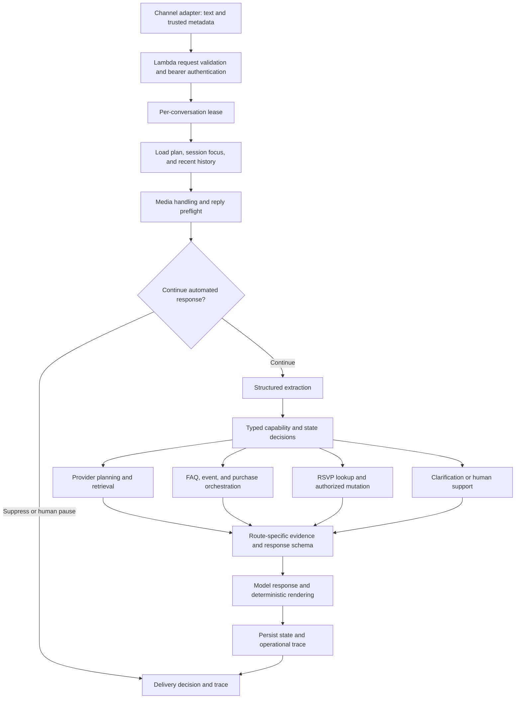

# Recap Agent: implementation-grounded capabilities report

## 1. Scope and central finding

Recap Agent is a Spanish-language conversational runtime for Sin Envolturas that combines persistent event-provider planning with customer support, knowledge retrieval, phone-scoped event and purchase lookups, invitation-response management, and human participation controls. Its architecture is a combination of structured language-model interpretation, deterministic state transitions, bounded retrieval, explicit gateway contracts, and constrained response generation.

The primary planning artifact is an event plan with multiple provider needs. The system also handles interactions that never require a provider plan: a commission question, a purchase-status inquiry, a question about an associated event, an RSVP update, or a support follow-up. Describing the system only as a vendor recommender would omit substantial implemented behavior.

The system should not be described as an unconstrained autonomous general assistant. Models interpret intent and generate selected response content; TypeScript code owns important routing, state changes, access decisions, evidence projection, API calls, and several final response fragments. The term “agent” here refers to this integrated runtime, not to a team of independent collaborating runtime agents.

### Evidence conventions

**Implemented** means the corresponding source path exists and was inspected. **Conditional** means execution depends on configuration, feature flags, gateway availability, or backend evidence. **Specified by a regression** means a test or evaluation defines the expected behavior; it is not evidence that a fresh live run passed. **Planned** refers exclusively to the additional FAQ evaluation module described in the companion document.

The source snapshot is commit `cce28e3b5c75863b1ff4e952055ba2ce2c7a9d7b`, inspected on 2026-09-04. The two pre-existing modified documentation files are not part of a new implementation change. No claims below establish production availability or production performance.

The [source index](source-index.md) maps sections to executable symbols and provides every loaded case, suite, test, and prompt path. Source references below are repository-relative paths for portability.

## 2. Research framing and defensible contributions

The implementation supports discussion of these engineering contributions:

1. **Persistent planning across multiple provider needs.** Shared event context is combined with separate need-level preferences, constraints, shortlists, selections, and lifecycle states.
2. **Structured interpretation with deterministic execution.** The extractor returns validated semantic data; runtime evidence selects reachable actions and prevents unsupported or premature operations.
3. **Context projection before model calls.** Instructions, schemas, tools, history, and factual results are reduced according to the active route and available state.
4. **Evidence-aware support across heterogeneous sources.** Public FAQ evidence, associated-event information, purchases, carts, and RSVP records have distinct typed contracts and disclosure rules.
5. **Conversation-aware operational controls.** Response suppression, campaign interpretation, human handoff, and per-conversation serialization operate around the conversational flow.
6. **Interaction-derived regression evaluation.** Stored context, backend fixtures, hard structural assertions, semantic judging, and a behavior-change registry connect fixes to reproducible cases.

These are descriptions of system design. Novelty relative to prior research, superiority over another architecture, reductions in hallucination or cost, and improvements in user outcomes require external literature and experiments. This dossier does not manufacture those claims.

## 3. End-to-end architecture

This is a logical architecture diagram, not an assertion that every request performs every step or that the branches execute concurrently. Media-only messages, active human takeover, suppression, capability boundaries, and some support paths short-circuit normal generation.

### 3.1 Request and response boundary

`src/lambda/request-contract.ts` defines a validated message request containing `text`, `user_id`, `channel`, optional message and session identifiers, timestamps, contact phone, client mode, media metadata, and a development-only backend fixture selector. Text is bounded at 16,000 characters, and the media array at ten items. At least text or media is required.

WhatsApp channels require a supported international contact phone. Media entries contain a kind, provider media identifier, MIME type, SHA-256 digest, and optional filename. The schema validates MIME-family compatibility. This is metadata support; it does not imply that the model can inspect the attachment.

All supported runtime routes are POST requests: `/` processes messages, `/conversations/overtake` gives the conversation to human participation, and `/conversations/resume` re-enables the automated agent. Channel authentication uses bearer keys. The Lambda Function URL is configured with AWS `AuthType: NONE`; application-level bearer verification is therefore the relevant inbound control, not IAM authentication at the URL.

The normal response carries delivery instructions, the outbound message, current node, and trace identifier. Explicit CLI diagnostics add redacted plan, trace, and performance information. The adapter must honor suppression; an empty or suppressed message is not a generated customer answer to send.

### 3.2 Logical stages

`AgentService.handleTurnCore` coordinates the turn. It loads state, incorporates trusted channel contact metadata, constructs recent-message context, handles preflight controls, extracts structured information, applies capability boundaries, and routes to planning, information, RSVP, or clarification. It saves the resulting state and produces a trace.

`OpenAiMessageResponseClassifier` is a separate structured model call for response delivery and conversation health. `OpenAiAgentRuntime.extract` uses an Agents SDK agent with a dynamic extraction schema. `OpenAiAgentRuntime.composeReply` builds a node-specific agent with a constrained output schema and an allowed tool subset. These stage roles must not be described as exactly three calls on every turn: stages can be skipped, retry, invoke tools, or have their response replaced or supplemented deterministically.

### 3.3 Dependencies and configured defaults

The repository uses strict TypeScript and Zod schemas, the OpenAI Agents SDK, the OpenAI client, AWS SDK clients, DynamoDB, Lambda, and Secrets Manager. `package.json` declares `@openai/agents` at `^0.14.2`; the inspected lockfile resolves it to `0.14.2`. The build targets Node 24 and produces bundled runtime, terminal, knowledge-sync, and provider-sync entry points.

The local default text model string is `gpt-5.6-luna` for reply, extraction, and response classification. This is the repository's configured default, not a claim that it is the latest public model or that a deployed stack currently uses it. Model settings include stored responses, cache keys derived from prompt bundles, implicit cache options with a 30-minute TTL, and low verbosity/no reasoning effort on the applicable GPT-5 model path.

Default stage timeouts are 16 seconds for classification, 35 seconds for extraction, 22 seconds for reply, and eight seconds for retrieval. The CloudFormation runtime uses a 90-second timeout and 1,024 MB memory. These are limits, not measured latency. Stage durations, retries, tool use, queue waiting, and cold initialization affect observed end-to-end time.

## 4. Persistent state and continuity

### 4.1 Event-plan representation

`src/core/plan.ts` defines a plan with identity, channel/user scope, conversation identity, current node, intent/confidence, event context, contact details, provider needs, a conversation summary, assumptions, and open questions. Additional sub-states track information requests, authentication, RSVP, human escalation, and conversation health.

The lifecycle values are `active` and `finished`. A temporary pause is represented through flow state rather than a third top-level lifecycle value. The event categories are wedding, birthday, corporate event, baby shower, graduation, baptism, anniversary, quinceañera, and other, represented by the canonical identifiers in `src/core/event-type.ts`.

A provider need has one canonical category, a status, preferences, hard constraints, missing fields, recommended providers, optional sub-query results, selected provider IDs, and selected references. Statuses distinguish identified, search-ready, shortlisted, selected, deferred, and no providers available. Top-level provider fields project the active need; they are not the whole multi-need plan.

The plan stores a budget signal and guest-size bands (`1-20`, `21-50`, `51-100`, `101-200`, `201+`, and `unknown`). It is not a full event accounting system, booking calendar, or resource-allocation optimizer.

### 4.2 Persistence and session focus

`DynamoPlanStore` keys the plan by channel and external user, stores the current plan under `PLAN`, and reads it consistently. Session focus is stored separately under `SESSION#<sessionId>` and includes the active category, most recently presented categories/provider IDs, and last node. This helps interpret references against the current interaction without replacing the shared plan.

The runtime therefore does not key the canonical plan solely by a transient terminal session. Distinct sessions for the same channel/user can share plan state. Conversely, different channels form different persistence partitions; channel-agnostic logic does not imply automatic cross-channel identity unification.

The inspected CloudFormation plan table does not define a TTL. Performance records have a separate TTL and configurable retention. Do not copy old claims that every temporarily closed plan expires automatically unless a separately verified current mechanism establishes that behavior.

### 4.3 Recent conversation context

`turn-message-context.ts` uses a bounded recent history from the Agent API. It removes the current inbound message, deduplicates by message ID, and retains up to five recent messages. Model-visible bodies are bounded at 600 characters with beginning/end preservation; the classifier has its own smaller or campaign-specific projections.

Continuity is derived from persisted state and recent history into `new`, `continuing`, or `degraded` plus a lane: planning, public FAQ, purchase support, event support, RSVP, human handoff, or unresolved. This derived evidence is not a second persistent memory system. Welcome permission is restricted when prior context exists or history is degraded.

Short follow-ups resolve through pending information, the last completed information request, and recent messages. Structured support acts cover issue reports, supplied details, deferred submissions, and policy questions. A follow-up supplying a person or event name can be acknowledged without starting provider planning or inventing a new information lookup.

### 4.4 Resume, reset, and completion

Resume decisions consider finished plans, an in-progress close, pending information, active RSVP work, selections, shortlists, and missing fields. Deferred and exhausted provider needs are distinct from unfinished selectable shortlists. Reset discards the previous planning context. A finished plan can still be used as context for support; recognized planning requests can start a fresh plan instead of being trapped in a completed state.

## 5. Capability boundaries

`capability-manifest.ts` defines stable semantic operation IDs. Configuration and concrete gateway manifests are intersected: a method's presence on an interface alone does not make the capability available. Reasons distinguish enabled, disabled by feature flag, missing gateway, blocked writes, unimplemented operation, and unavailable media.

| Operation family | Implemented behavior | Conditions and boundary |
|---|---|---|
| Public FAQ | Retrieve knowledge and compose evidence-based answers | Requires enabled, configured knowledge retrieval |
| Event association/detail | Read associated events and supported detail | Trusted-phone or authenticated scope; backend coverage governs claims |
| Purchase orders/gift detail | Read and reconcile supported purchase evidence | Scope and projection determine what can be disclosed |
| RSVP read | Inspect available invitation state | Event association alone is not authoritative RSVP state |
| RSVP write | Save an attendance decision and supported single-companion response | Explicit decision, resolved invitation, available write gateway |
| Provider planning/search | Elicit needs, retrieve, compare, select, refine, resume | Feature flags and search readiness apply |
| Quote requests | Submit selected provider quote requests | Valid contacts and enabled customer writes |
| Phone/email authentication | Account lookup or email-code verification where applicable | Not required for every phone-scoped support read |
| Human takeover | Register support handoff and control automated participation | Backend result and specialized branch semantics matter |
| Confirmation document sending | No implementation | Explain boundary and offer supported assistance |
| Image inspection | Unavailable | Attachment metadata does not provide visual understanding |
| Payment-proof verification | No implementation | Cannot validate a receipt or assert payment from an image |
| Purchase modification | No implementation | Read support does not authorize editing purchases |
| Refund/withdrawal execution | No implementation | Policy explanation differs from financial execution |

Ambiguity that crosses supported and unsupported operations produces a bounded clarification, such as whether the person wants payment status or a confirmation document. Domain ambiguity within an available capability is left to that domain's state machine. Unsupported requests may still be accompanied by a safe read when the branch permits it; the answer must distinguish the information obtained from the action that cannot be performed.

The standard development runtime blocks customer write operations, while fixture runtimes can simulate outcomes. Production construction enables customer writes. A passing development fixture does not establish a real customer mutation, and source availability does not establish successful integration with every backend operation.

## 6. Provider planning and recommendation

### 6.1 Need elicitation

The runtime handles a narrow provider request and a broad event-planning request. Broad requests can produce a bounded starter set of event-relevant provider categories. It avoids interpreting a mere location or a general support reference to an event as a venue requirement. Need priority is represented separately from whichever category was last active.

The canonical provider taxonomy has 17 categories: accessories/shoes, catering, home/decor, flowers/stationery, photography/video, makeup, music, dresses, wedding planners, other, babies, health/beauty, suits/shirts, dance, travel, venues, and liquor. Search buckets can group related categories. These are marketplace classifications; their existence does not prove inventory in every category or location.

### 6.2 Search readiness

`computeSearchSufficiency` requires a provider category, location, and either a budget signal or guest-range value. Event type is helpful context but is not a required field in this deterministic minimum. Exact event date and exact budget are not mandatory search inputs.

Multi-need requests also carry structured query intents with their own retrieval-readiness and missing-field evidence. A query intent has a category, priority, preferences, constraints, fit criteria, and one to three sub-queries. Thus the runtime can preserve distinct concepts within one category, such as two types of food service, rather than collapsing them into a single undifferentiated category search.

When required information is absent, the runtime asks for the missing information. When enough evidence is present, it proceeds rather than repeatedly asking for optional details. A selected provider should not trigger another search merely because the user confirms the selection.

### 6.3 Retrieval sources and search modes

`SinEnvolturasGateway` implements API, vector, and hybrid retrieval. API retrieval uses marketplace category/location/keyword mechanisms. Vector retrieval queries a separate provider vector store, reads provider IDs from metadata, and enriches candidates through provider-detail lookups. Hybrid plan search combines API and vector candidates by ID and retains provenance.

The query-intent path is vector-first when available and can fall back to category/location search if there are no vector providers. Do not describe all hybrid paths as the same parallel rank-fusion algorithm: implementation details differ between plan search and query-intent search, and the inspected hybrid plan path performs vector work before the API lookup.

Defaults in `config.ts` include 12 persisted search candidates, up to 24 vector results, a vector score threshold of 0.2, six reply-context candidates, six presentation candidates, and three detail lookups. These are configurable ceilings or defaults. The actual number presented depends on eligibility, available inventory, route, sub-query selection, and model output. Historical case names mentioning four recommendations are not the current global configuration.

### 6.4 Ranking and eligibility

`provider-fit.ts` applies deterministic fit scoring to candidate metadata. Signals include price tier versus budget tier, event-type fit, category/need fit, textual preference matches, avoidance signals, and semantic retrieval score. Sorting uses fit score, retrieval score, and provider ID for tie-breaking.

Strict budget-risk signals for lower budgets, constraint-risk tags, and need-mismatch tags can exclude candidates. Sub-query selection uses a fit threshold of 40, a configurable number of selections per sub-query, category restrictions unless cross-category search is allowed, and additional event-service evidence for home/decor candidates.

These are heuristics over marketplace descriptions and metadata. They are not learned relevance probabilities, exact price quotes, verified availability, or a guarantee that every natural-language constraint is satisfied. Qualitative budget parsing maps phrases to representative amounts for scoring; it does not establish an actual transaction amount. Location compatibility is based on normalized aliases and region/country rules, not distance computation or geocoding.

### 6.5 Multi-need execution and presentation

`executeMultiNeedProviderRetrieval` orders needs by priority and retrieves independent needs/sub-queries with promises. It retains sub-query candidate and selected IDs, candidates, and no-match reasons, then collects need-level recommendations. Unsearched needs can retain existing state; searched needs are rebuilt according to the requested operation.

The structured reply can group providers by need. The renderer resolves provider IDs against retrieved evidence and omits unknown IDs. In grouped recommendations it also checks category membership. Names, links, locations, and price labels are taken from provider records, while the model supplies bounded explanatory text. This prevents a fabricated provider ID from automatically becoming a valid displayed provider card, but does not prove that all free-text rationale is faithful.

### 6.6 Selection, refinement, and plan editing

Structured operations support adding, updating, deleting, deferring, and reactivating needs; selecting/unselecting providers; and replacing a selected provider. References can include an ID, title, category, or hint and are resolved against known plan evidence and presentation context. The system supports multiple selected providers in one need and selections across needs.

Ambiguous references are clarified rather than resolved to arbitrary records. Descriptive references such as a cheaper or location-specific option are represented by regression cases. A request to see existing options can reuse a stored shortlist. A request for more candidates can broaden search with bounded pagination and unseen-result tracking. A search error and a valid empty result have different states: an empty result can mark a need as having no providers, whereas a transport/search error enters retry handling.

### 6.7 Closing and quote requests

Closing distinguishes selected providers, unresolved shortlists, deferred needs, and contact collection. Contact validation checks email and supported international phone format. Close actions are typed as confirm close, defer a need, request contact, abandon the plan, or clarify. A need with presented but unselected choices can block premature final closure until it is selected or explicitly deferred.

`executeFinishPlanTool` sends a quote request for each selected provider and returns per-provider success/failure plus overall `success`, `partial`, or `failed`. A partial or full success marks the plan finished; all failures do not. This is lead/quote-request submission, not a booking, payment, signed contract, or provider availability guarantee.

An important implementation limit is that this tool sends the current date as `eventDate`, because the persisted planning model does not maintain a dedicated scheduled-event date used here. It also does not constitute an atomic transaction across all provider requests. The paper should explicitly distinguish partial completion from complete success and avoid claiming transactional exactly-once lead creation.

### 6.8 Additional marketplace tools

The runtime tool surface includes category/location browsing, provider details and tracked views, related providers, reviews, event vendor context, favorites, quote requests, adding favorites, creating a review, and finishing a plan. `prompt-manifest.ts` assigns maximum tool sets by node; `dynamic-agent-policy.ts` narrows them by plan capability and the runtime manifest. A tool existing in the interface does not imply that every turn can invoke it or that every tool has a separately evaluated end-to-end customer workflow.

## 7. FAQ and knowledge-based support

### 7.1 Sources and ingestion

The knowledge pipeline can scrape the official Sin Envolturas help center and ingest supplemental customer-service templates from a local Notion export. ATC ingestion selects rows marked ready (`Listo`) for the Chat channel, extracts the relevant chat/social section, preserves source/status metadata, and produces Markdown. Trigger hints are semantic evidence in the document, not exact-match routing keys.

The synchronization pipeline uploads batches to the knowledge vector store, cleans old batches for the source, and checks current file count, stale source files, and duplicate slugs. Provider search has its own ingestion pipeline and vector store. The two corpora serve different decisions and must not be conflated in an architecture figure or retrieval-quality metric.

Source and status handling matter: ingestion's ready/channel predicate is not itself a universal “current policy only” filter. For the withdrawal policy, a separate parser checks an exact audited article and current-status marker before extracting its numeric policy. The current contents, freshness, and document counts of remote stores were not inspected for this report.

### 7.2 Retrieval and response evidence

`OpenAiKnowledgeRetrievalGateway` uses vector-store search with query rewriting enabled by default, a configurable result limit, and score threshold. It returns file ID, filename, score, and excerpt text. The defaults request six results with threshold zero. Each retrieved result is initially bounded at 6,000 characters.

The reply projection is narrower: a general completed FAQ result exposes only the first retrieved evidence item, truncated to 1,200 characters. This distinction is critical for the paper. The system may retrieve multiple chunks but not expose all of them to the answer model. Evidence retrieval success therefore does not establish answer completeness, particularly for questions whose applicable facts span several documents or the end of a long article.

FAQ prompts require answers from retrieved evidence, direct inclusion of applicable numerical values when present, and explicit lack-of-information handling when evidence is empty. They prohibit provider recommendations from the information node. A general policy question can be answered without account authentication.

### 7.3 Multiple informational requests

The extractor can produce an ordered batch containing FAQs, associated-event requests, and purchase requests. `InformationOrchestrator` returns separate typed results with `completed`, `needs_input`, or `failed`. Non-purchase requests are processed before purchase requests so event-derived context can be reconciled. Within each phase it uses settled promises to preserve independent successes despite another request failing.

The reply should present completed answers first and end with one actionable next step for blocked work. A planning action combined with information requests is not equivalent to an information batch: the inspected service can ask which route to resolve first instead of executing both. Do not claim arbitrary simultaneous execution of all user intentions.

### 7.4 Host withdrawal policy

Host withdrawal questions use a specific policy path. `parseHostWithdrawalPolicy` selects the audited `atc-template-new-solicitud-de-fondos.md` evidence, requires a current status marker, extracts an unambiguous processing-hours value, and projects only that fact. The runtime separates a general policy question from an individual's missing-withdrawal status.

The agent can explain a verified general processing policy and facilitate human support. It cannot execute the withdrawal or inspect an individual financial transaction merely because the user reports being the host. Report the retrieved policy value only from a verified execution; this dossier deliberately does not substitute a hardcoded claim about current withdrawal policy.

## 8. Event and purchase information

### 8.1 Access paths

The current default support path first tries scoped contracts using the trusted channel phone when there is no valid existing account session and no explicit ongoing email/OTP action. This can serve guests and accountless users. It is more specific than “all personal information requires email OTP” and differs from older phone-confirmation-first descriptions.

Trusted phone scope is a backend association, not proof of exclusive personal ownership of every returned item. The answer must reflect the provenance actually available. An account lookup is a different operation from a phone-scoped event/purchase read. Authentication state, channel trust, and the scope of the backend endpoint must remain separate in the paper.

### 8.2 Associated events

Event lookup supports account-associated or trusted-phone guest associations, event selection, and supported detail retrieval. Typed event information can include identity, date, location and other available event/attendance context. Missing event identity or partial backend coverage is represented as unavailable/partial evidence rather than converted into “there is no invitation.”

An event response can contain nested purchases from the backend. The orchestrator removes those from the event answer and reconciles them through the purchase path. Thus a response about an event does not automatically authorize disclosing every nested amount or transaction.

### 8.3 Orders, gifts, and carts

Purchase requests distinguish `orders` and `gift_purchases`, and requested aspects include summary, payment status/details/options, validation window, shipping, dedication, thanks, and decline information. Gateway contracts normalize external records before they reach response generation.

Phone orders can be partitioned into pending, completed, and legacy records. Carts remain a separate type with status and abandonment evidence; they are never simply relabeled as orders. The backend's pending partition can include declined/error/null-status entries, so the selection guard explicitly treats terminal declined status differently.

Current and historical records are reconciled by typed reference evidence. Selectors include order/transaction reference, event hint, amount, and supported date evidence. A unique current pending record can take precedence for a current payment question. An explicit unresolved reference is not widened back to unrelated historical records. Ambiguous candidates can require user selection.

There are limits to these selectors. The current unique-pending guard can treat a lone amount as payment evidence rather than identity, and its code documents a residual historical-amount ambiguity. The date helper compares supported date fields against event date; do not claim a general natural-language purchase-date resolver without a case demonstrating it. No source inspection proves every possible multi-record ambiguity is resolved correctly.

### 8.4 Amount, currency, and balance disclosure

The orchestrator creates one `amountDisclosure` representation instead of exposing several competing total/payment fields. If the backend does not report currency, the reply receives a “currency not reported” constraint rather than permission to infer PEN or USD from the user's message. Pending status without a known paid amount cannot establish an outstanding balance.

Cart projections omit subtotal and amount disclosure. The final reply projection exposes only a bounded cart summary and, when relevant, minimal same-event cart context next to a selected order. Cart-only recovery paths can be rendered deterministically and refer to an existing recovery link in the conversation without inventing a URL or mailing event.

This behavior supports careful answers to reminders about pending transfers, active checkout, abandoned carts, and old versus current purchases. It does not calculate an authoritative balance when required payment data is missing.

### 8.5 Sensitive detail and physical fulfillment

Information projection is narrower than the raw gateway contracts and extraction schema. The orchestrator selectively projects requested fields and excludes bank routing identifiers/vouchers. The final reply projection additionally removes payment objects, decline code, admin comment, and customer transaction number. Consequently, the paper should not advertise that every schema-listed sensitive field can be displayed to users.

Customer-facing transaction codes can be accepted and resolved at lookup time. Current response projection removes the customer transaction number, despite older prompt text instructing COD formatting when available. Distinguish input-reference support from guaranteed outbound code display.

Shipping or physical-card state is presented only when physical fulfillment evidence exists. The reply layer additionally strips physical fields for cash-only gifts. A digital/cash gift's approved or pending status does not imply a shipment, delivery, or tracking event.

### 8.6 Payment-validation guidance

`purchase-disclosure-policy.ts` associates pending transfer/Yape/Plin/PayPal-family methods with an indexed validation expectation of up to 72 business hours and excludes card-family or unknown methods. This is a configured policy rule supported by the knowledge flow, not an observed service-level statistic. It must not be generalized to all payment methods or to host withdrawals.

The runtime separately projects limits when a payment time or remaining balance is not verifiable. A missing timestamp cannot support a claim that a business-hours window has elapsed. Offset-less timestamps are normalized conservatively; the system does not invent a timezone merely to make a time comparison possible.

### 8.7 Support continuation and failure handling

The service preserves pending and last-completed requests across clarifications and authentication. Structured support acts allow concise acknowledgement of mailbox-capacity issues, deferred proof submission, and details supplied about a affected person/event. These statements do not automatically authorize a mutation or verification of evidence.

Lookup results distinguish unconfigured, not found, unauthorized, unavailable route, invalid response, and request failure. Coverage can be complete, partial, or inconsistent. A technical failure is not the same as a valid zero-record response. Certain terminal scoped failures or exhausted authentication recovery trigger a human-support policy rather than a repeated login loop.

## 9. Account authentication and recovery

Phone authentication and email OTP remain implemented even though scoped reads now avoid unnecessary login on common support paths. A valid account session requires nonempty credentials and a future expiry. An explicit rejection of the phone-associated account is different from declining authentication entirely and can lead to email verification.

Email authentication accepts a registered address, requests a code, retains the protected request while awaiting the code, verifies it, and can reuse the returned session. Numeric OTP normalization includes supported Spanish number words. Operational traces redact code/token values. After successful email verification, the runtime can attempt to associate/update the trusted channel phone through the gateway.

Recovery states distinguish unknown email, sending failure, rate limiting, unavailable services, invalid code, unverified email, validation failure, and repeated failure. A first non-delivery report can trigger one resend; counters prevent an endless resend loop, and exhausted recovery routes to support. Guidance includes the destination email, waiting briefly, checking the main inbox/junk mail, copying the code into the conversation, and the inability to read screenshots when appropriate.

An explicit refusal to verify closes the protected query rather than perpetually asking for a code. A technical phone-authentication failure does not automatically justify falling back to asking for email. These are typed runtime distinctions with dedicated regression specifications.

This is application authentication orchestration. It does not establish security certification, universal phone ownership, immunity to account sharing, or complete anonymization of stored state. The adapter's authenticated source of phone metadata is part of the trust boundary.

## 10. RSVP behavior

### 10.1 Read state before deciding on a write

The RSVP flow uses trusted-phone invitation/event evidence and does not require email OTP as its normal path. It distinguishes a pending invitation, already attending, already declining, no matching invitation, a campaign-backed association without a retrievable invitation record, missing identity, and lookup failure.

The model's extracted decision includes whether it comes from the current message or plan state. An old stored action is not blanket authorization for a new RSVP mutation. Pending authorization can be retained through event selection; a current read-only query must not accidentally replay a write.

### 10.2 Explicit action and event resolution

If no explicit attendance decision is available, the runtime reports known state or requests the missing action. Multiple invitations require selection based on grounded event candidates. An already-saved matching response is reported without a redundant mutation. A requested reversal, such as declining to attending, is submitted only when the operation is available.

Campaign history provides conversational context, but it cannot substitute for an authoritative invitation status. The agent should not say that an invitation does not exist simply because a lookup cannot expose its record, and should not claim a successful update when no update occurred.

### 10.3 Companions and group requests

The typed party representation distinguishes self from self-and-others, named people, one/multiple/unknown companion count, and a yes/no/unknown plus-one response. A supported single companion can be submitted with or separately from attendance. The backend controls eligibility and can report a rejected plus-one update; the agent must not claim success in that case.

Multiple companions or unresolved multi-person attendance requires human assistance. The specialized handoff preserves RSVP state, records a deduplication marker after successful backend registration, and avoids sending the same handoff repeatedly. Failed registration has an honest failure response. This does not imply arbitrary guest-list editing or RSVP updates on behalf of multiple named guests.

### 10.4 Response rendering

Known RSVP state, event selection, and mutation outcomes use deterministic fragments or complete replies in several branches. The flow can still call the reply model before overriding or appending text. Therefore “deterministic final wording” must not be presented as proof that the corresponding turn used zero model calls.

## 11. Response delivery, human support, and language

The response classifier predicts whether to respond or suppress an acknowledgement, reaction, or automated reply. Automation evidence includes confidence, pattern, and whether it describes the current sender rather than quoted content. Campaign replies have a specialized profile so that attendance decisions and actionable requests reach extraction while non-actionable campaign closures can be suppressed.

Deterministic guards preserve responses to outstanding help offers and active RSVP work. Classifier failure falls back to responding, rather than silently dropping the message. `observe` and `enforce` modes distinguish measuring suppression decisions from applying them; the configured default is enforce.

Conversation health distinguishes progressing, uncertain, stalled, and frustrated. An explicit frustrated assessment or two consecutive non-progress assessments can trigger an optional human-help offer when none is active. Acceptance requests takeover; decline is retained so the offer is not immediately repeated. Normal progress can reset that offer state.

When a plan has active general human escalation, subsequent automated replies are suppressed until the participation endpoint resumes the agent. The specialized multi-person RSVP handoff has its own deduplication/state semantics and should not be described as identical to every general takeover branch. Some general escalation paths retain requested state even when registration fails or is skipped; trace and stored error must be consulted before claiming a human successfully received the request.

The customer-facing policy is Spanish. Structured schemas use fields such as `paragraphs_es`, and rendering normalizes selected English/marketplace vocabulary. Support-address guardrails normalize unsupported addresses to the approved support email. Jailbreak-pattern guardrails provide a bounded refusal path. These are targeted controls, not empirical proof of complete injection resistance or multilingual correctness.

The runtime accepts attachment metadata but does not implement image reading, audio transcription, video understanding, document extraction, or payment-proof verification. It can explain that limitation and request useful text. Streaming is out of scope; the terminal is intended to exercise the same message-oriented interaction as WhatsApp.

## 12. Operations, coordination, and observability

### 12.1 Serverless infrastructure

CloudFormation defines the runtime Lambda, Function URL and permissions, plan/performance tables, IAM role, and CloudWatch log group. Secrets are resolved through configured sources; source defaults and deployed parameters must be recorded separately. Build scripts package prompts and evaluation fixtures with the runtime.

Knowledge/provider synchronization has runnable source handlers and CLI scripts. The inspected main stack does not prove an automatic recurring synchronization schedule. Describe ingestion as an available pipeline unless a deployment artifact verifies scheduled operation.

### 12.2 Per-conversation serialization

The Lambda acquires a DynamoDB-backed lease for the channel/user before running a turn. Participation-control requests share the coordination mechanism. Lease ownership is conditional, expiry extends through the hard Lambda deadline plus a safety interval, and release is owner-checked. The lease is fixed rather than renewed periodically.

Waiting is bounded by both a configured wait interval and execution reserve. Busy or unavailable coordination returns HTTP 503 with a retryable code and `Retry-After: 2`; it does not run a competing turn without the lease. This reduces overlapping read-modify-write races on the same plan while allowing different conversation keys to proceed independently.

This is serialization, not a durable FIFO queue or general message deduplication system. A repeated external message ID is not by itself proof of exactly-once side effects. Gateway retries and partial quote submissions need separate treatment when discussing reliability.

### 12.3 Trace evidence

`core/trace.ts`, `logs/trace/perf.ts`, and request/auth observability record node path, route decision, extraction summary, state summary, missing fields, tools considered/called, tool evidence, provider candidates and provenance, search strategy, contact/close/auth outcomes, information-result coverage, and classifier behavior.

OpenAI call references include response/request IDs, model, attempts, instruction bytes, input bytes, tool count, and schema-property count. Token usage separates classifier, extraction, reply, and total, with cache-related fields when available. Timings distinguish stage work. Prompt bundles have content-derived hashes and paths so a run can be associated with its instruction set.

Parallel retrieval timers can sum durations across concurrent operations; they are not automatically additive wall-clock components. Use total request/turn latency for end-to-end timing and explain the semantics of internal stage totals before deriving a latency decomposition.

### 12.4 Privacy and diagnostics

Evaluation and explicit CLI artifacts use safe projections that remove phone/email/token fields and omit tool payload bodies. Free-text redaction is separate from structural JSON projection so IDs, timestamps, and hashes are not indiscriminately rewritten. The full persisted plan still contains operational contact/authentication state. Names, summaries, event labels, and other free text are not guaranteed anonymous merely because selected fields were redacted.

Stored OpenAI responses and detailed internal logs are audit facilities, not public appendices. A publication dataset needs its own de-identification review. This report does not reproduce real phone numbers, email addresses, or raw customer transcripts.

## 13. Existing evaluation system

### 13.1 Current inventory

The validated catalog has 105 cases, of which 80 allow live Lambda execution and 29 allow offline execution; eligibility overlaps. Nine suite manifests define smoke, development regression, feedback regression, comprehensive live, FAQ-source, token-regression, mandatory behavior-regression, and benchmark selections. There are 59 explicit mandatory behavior-suite members, 165 behavior-change registry entries, and 105 test files.

These are repository inventory values, not independent trials or success statistics. The source index lists all cases and memberships, avoiding an assumption that filenames or tags alone define suite execution.

### 13.2 Offline target

The offline evaluator runs `AgentService` with in-memory storage and fixture extraction/reply/provider behavior. Cases can seed plans and define multiple turns. It tests deterministic behavior under controlled inputs, such as state transitions, provider selections, persistence, and errors. Because interpretation and response generation are substituted, an offline pass cannot establish real model comprehension or answer quality.

Dedicated unit tests also exercise authentication, information orchestration, RSVP authorization, concurrency, redaction, request contracts, prompt projection, provider ranking, and other components. Not every unit test is a loaded conversational evaluation case.

### 13.3 Live Lambda target

The live evaluator sends requests to the development Lambda, can seed plans, provides trusted contact/session context when required, validates the returned envelope, and records outcomes. The fixture selector is accepted only in development. Fixture runtimes preserve model/prompt/runtime execution while replacing selected backend data or mutation outcomes.

Fixtures therefore provide repeatability without claiming to be real marketplace transactions. Other cases use live services and can have environmental dependencies. RSVP isolation hooks and concurrent-turn support cover specialized execution needs. A paper must report target, fixture mode, backend snapshot, and write isolation separately for each result group.

### 13.4 Assertions and semantic judging

The evaluator supports plan equality/subsets, node transitions/path membership, provider identity/count, trace equality/subsets/numeric bounds, required/forbidden tools, text inclusion/exclusion, semantic text criteria, trajectory invariants, budgets, and token-usage presence. Assertions have hard or soft severity.

The semantic judge receives a rubric, candidate response, and optional interaction context and returns a score and reason. The runner compares the score with the case threshold. A `requireJudge` setting makes a missing judge fail. Importantly, that setting defaults to false in the general schema; do not assume every old semantic expectation is mandatory merely because it exists.

`eval:behavior-live` requires the judge key and fails for zero cases, failed assertions, errors, skips, or any non-passing case. The behavior-change registry requires each registered change to point to a mandatory live case with hard structural and required hard semantic expectations. A single case may cover multiple changes, so registry count is not sample size.

The one executed validation for this dossier, `tests/live-behavior-coverage.test.ts`, passed. No live suite was run and no conversational pass rate was established here.

### 13.5 What existing grounding measures

`assessGrounding` checks recommendation provider IDs against candidate audit records and compares available category/location attributes. For a factual FAQ turn, it checks for completed knowledge retrieval with a positive result count. These checks are useful provenance indicators.

They do not establish whether every sentence is correct, whether every part of a multi-part question was answered, whether the right article was retrieved, whether a numeric exception was omitted, or whether a rationale is supported. The existing FAQ-source and semantic regression cases add targeted behavior expectations, but they are not a dedicated general FAQ completeness-and-correctness module. That gap motivates the planned module in the companion document.

### 13.6 Study tooling and metrics

The technical-study schemas define 50 scenarios, five event groups with ten scenarios each, and three repetitions. The v4 manifest overlays v3. These numbers define a protocol, not evidence that 150 interactions were successfully executed for the current code snapshot. The route families are predominantly planning-oriented and do not comprehensively represent all newer support and RSVP branches.

Study outputs include conversation-level outcomes, latency, token use, tool use, priced cost components, grounding tables, manual-audit templates, and charts. Pricing comes from versioned local files. Historical prices and baseline reports cannot establish present cost or current comparative performance without version/configuration alignment.

The generic `branch_coverage` metric is visited decision nodes divided by the node count; it is not source branch coverage. “Tool precision” and “tool recall” are operational proxies derived from expectation results and actual call counts, not a fully annotated conventional action-classification confusion matrix. Transition coverage uses a versioned reachable-transition registry and needs revalidation when the flow expands. Document these definitions instead of giving the metric names stronger meanings.

The [planned FAQ evaluation](faq-evaluation-module.md) adds interaction-level binary completeness and correctness outcomes, synthetic source providers, and controlled conversations. Its dataset size, results, confidence intervals, latency, and cost remain TBD.

## 14. Important qualifications for paper claims

| Avoid this claim | Supported wording or unresolved qualification |
|---|---|
| The agent only recommends one provider at a time | It maintains multiple needs and multiple selections, including sub-queries within a category |
| All account-related questions start with OTP | Common event/purchase paths use trusted-phone scoped reads first |
| It can read receipts/screenshots | It accepts metadata and explains unsupported image inspection |
| Retrieval proves answer correctness | Current grounding includes provenance checks; sentence correctness/completeness need separate evaluation |
| All six retrieved FAQ chunks reach the model | General reply projection uses the first result, bounded at 1,200 characters |
| Every payment detail in the schema is displayed | Final projection removes several sensitive fields and transaction-number output |
| It books vendors or completes payments | It can submit enabled quote requests and read supported purchase evidence |
| It manages arbitrary groups of invitees | Single-companion support is bounded; multi-person requests use human support |
| Paused plans automatically expire | The inspected plan table has no TTL |
| Serialization ensures exactly-once processing | It protects overlapping turns; deduplication and side-effect idempotence are separate |
| All handoffs were received by a human | Gateway status and branch-specific persistence determine what occurred |
| The architecture has no keyword heuristics | Semantic routing is model/typed-state driven, but normalization, ranking, guardrails, and some legacy helpers use textual rules |
| All prompts are perfectly current and conflict-free | Some prompt prose retains old auth/COD/payment-detail assumptions; final runtime projection limits behavior |
| The code is entirely free of compatibility handling | Storage normalization still handles old scalar selections and strips retired state |
| All prompts exist only in prompt files | File-backed node/extractor prompts coexist with some inline deterministic messages, guardrails, and judge instructions |
| The current production deployment passed all tests | Only local catalog/registry validation was performed for this report |
| The new FAQ experiment was already completed | Its completed-work draft is conditional; implementation and results are TBD |

The qualification rows are not a request to change code in this pass. They identify where a paper writer should avoid repeating an aspirational convention or old document as an established implementation fact.

## 15. Suggested paper structure

### Abstract

Describe the problem of combining event-provider planning and customer support in a message-oriented channel. Name structured extraction, persistent multi-need state, grounded retrieval, typed support access, and action boundaries. State the evaluation dimensions. Leave performance and outcome numbers TBD unless tied to verified run artifacts for the reported system version.

### Introduction and problem definition

Explain why a single interaction can involve changing needs, provider references, FAQ questions, accountless purchases, invitation responses, campaign context, and human support. Define the boundary between finding/explaining information and performing operational writes. Avoid implying that a language-only benchmark captures all of these obligations.

### System design

Use Sections 3–5 for architecture, state, context construction, model roles, capability availability, and channel contracts. Include a data-flow figure and a state representation table. State which decisions are deterministic, model-assisted, or backend-authoritative.

### Domain workflows

Use Sections 6–11 to describe planning/retrieval, FAQ orchestration, purchase/event support, authentication, RSVP, and delivery/handoff. Include short de-identified examples with explicit pre-state and evidence, rather than isolated user phrases. The source index identifies suitable regression cases.

### Evaluation methodology

Separate unit/offline validation, live Lambda behavior regressions, the technical-study protocol, and the planned FAQ completeness/correctness module. Define denominators, hard failures, judge requirements, fixture isolation, and statistical units. Do not pool fundamentally different targets into a single unlabeled accuracy rate.

### Results

Use a table with TBD cells for current-version metrics not verified by an artifact. Suggested rows: interaction completion, hard structural pass rate, required semantic pass rate, FAQ completeness, FAQ correctness, combined FAQ pass, unauthorized-write failures, provider factuality audit, latency distribution, and priced cost. Explain exclusions and errors rather than removing them from denominators silently.

### Discussion and limitations

Discuss evidence truncation, incomplete backend records, synthetic-to-real transfer, judge bias, limited history, model/version drift, heuristic ranking, non-atomic quote submission, supported-language scope, and lack of user-outcome evidence. Distinguish implementation guarantees from experimentally observed reliability.

### Reproducibility appendix

Record commit, dirty state, deployed code identifier, feature flags, all model/judge identifiers, prompt hashes, schemas, data-source snapshots, fixture versions, case/suite versions, timestamp, runtime configuration, raw result paths, and pricing assumptions. Use the companion index as the starting source map.

## 16. Instructions for the next writing agent

1. Read this dossier before consulting older architecture prose. Recheck symbols if the checkout differs from the recorded commit.
2. Use code for behavior, prompts for model instructions, cases for expected interactions, and run artifacts for observed results. None of those evidence classes substitutes for all the others.
3. Verify the actual deployed configuration before writing deployment-specific claims. Repository defaults are not an environment snapshot.
4. Preserve the planned status of the FAQ module until its implementation and run artifacts exist. The companion draft is usable as completed-work wording only after that condition is met.
5. Build paper examples from the complete fixture/pre-state/turn sequence and expected behavior. De-identify names and identifiers for publication; do not reproduce source phone numbers or sensitive payloads.
6. Report the technical-study protocol's historical scope accurately. Newer purchase, authentication, RSVP, and continuity behavior needs its own cases/results.
7. Treat gaps and implementation qualifications as limitations, not as achievements. Do not infer latency savings from prompt projection without measurements or factual correctness from successful retrieval alone.
8. For future repository AWS work use the prescribed `se-dev` profile and `us-east-1`; mutating scripts must verify the prescribed account. This report itself requires no AWS access.

No runtime, prompt, evaluation implementation, infrastructure, or older documentation was changed in preparing this report. No redeployment or live behavior gate was needed for these report-only additions.
