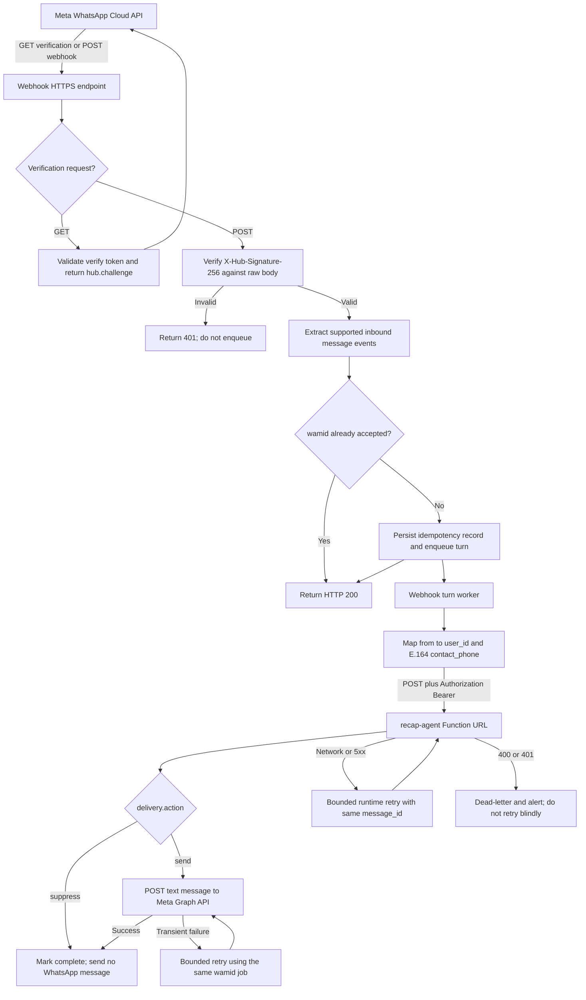

# Channel Integration and Telemetry Contract

This guide is the working contract for connecting consumer channels to the deployed recap-agent runtime. It covers the live Lambda Function URL, request and response payloads, telemetry persistence, provider API dependencies, and the adapter responsibilities that must stay outside the channel-agnostic runtime.

Last verified against CloudFormation outputs on 2026-07-15.

## Live Runtime Endpoints

Current development deployment:

| Purpose | Value |
| --- | --- |
| Runtime HTTP endpoint | `https://jwtjjociscvaa5dsrp5gokmno40doiva.lambda-url.us-east-1.on.aws/` |
| HTTP method | `POST` |
| Function URL native auth | `NONE` (no SigV4/AWS credentials) |
| Application auth | `Authorization: Bearer <CHANNEL_API_KEY>` validated from Secrets Manager |
| AWS region | `us-east-1` |
| CloudFormation stack | `recap-agent-runtime` |
| Lambda function | `recap-agent-runtime` |
| Plans table | `recap-agent-runtime-plans` |
| Perf table | `recap-agent-runtime-perf` |
| Default channel fallback | `terminal_whatsapp` |

The runtime endpoint is a Lambda Function URL created in `infra/cloudformation/stack.yaml`. Lambda Function URLs only provide native `AWS_IAM` or `NONE` auth. This deployment uses `NONE` so adapters do not need AWS credentials or SigV4, then validates a standard HTTP bearer token inside Lambda before runtime initialization. The opaque bearer value is stored in Secrets Manager as `recap-agent/channel-api-key` and is separate from both `SE_API_KEY` and the OpenAI key. Lambda accepts the secret versions labeled `AWSCURRENT` and `AWSPREVIOUS` so credential rotation can overlap without interrupting an adapter that still holds the prior token.

Channel adapters must still verify the original WhatsApp webhook signature. The runtime bearer token authenticates the adapter to this Lambda; it does not authenticate Meta's webhook to the adapter. Keep the token server-side, never put it in browser code, logs, URLs, or WhatsApp payloads.

Configure the runtime URL and the adapter's single runtime credential:

```text
AGENT_FUNCTION_URL=https://jwtjjociscvaa5dsrp5gokmno40doiva.lambda-url.us-east-1.on.aws/
CHANNEL_API_KEY=<value provisioned from recap-agent/channel-api-key>
```

The adapter does not need `AWS_ACCESS_KEY_ID`, `AWS_SECRET_ACCESS_KEY`, an AWS profile, or SigV4 signing. AWS access is only needed by deployment/operations workflows that create or rotate the secret. Provision the key into the adapter's own secret store through the deployment pipeline; do not fetch it from Secrets Manager on every message.

The adapter must not call the Agent API `/messages` endpoint directly and must
not hold `SE_API_KEY`. After the adapter authenticates with `CHANNEL_API_KEY`,
Lambda resolves the private Agent API credential from Secrets Manager for
read-only history and human escalation. Message writes remain disabled unless
`AGENT_MESSAGE_LOGGING_ENABLED=true`. These are two internal trust-boundary
secrets, but only one credential is exposed to the channel adapter.

Resolve the latest deployment values instead of hardcoding them in long-lived adapters:

```bash
AWS_PROFILE=se-dev AWS_REGION=us-east-1 aws cloudformation describe-stacks \
  --stack-name recap-agent-runtime \
  --query "Stacks[0].Outputs" \
  --output table
```

## Runtime Boundary

The Lambda accepts one normalized inbound user turn and returns one synchronous reply. Streaming is intentionally out of scope because the target WhatsApp-like channel cannot consume streaming output.

Channel adapters own:

- webhook signature verification and auth;
- converting channel-native payloads to the normalized runtime request;
- stable external user identity mapping;
- message id and idempotency policy;
- channel-specific retry handling;
- rendering the returned `message` to the user;
- feedback capture and delivery status handling.

The runtime owns:

- plan load and save keyed by `(channel, externalUserId)`;
- intent and event-plan extraction;
- provider search and enrichment;
- Spanish reply composition;
- optional Agent API message logging through Lambda's private service credential, disabled by default;
- runtime traces and performance telemetry.

## Request Contract

Send JSON with `content-type: application/json` and `Authorization: Bearer <CHANNEL_API_KEY>`.

| Field | Required | Type | Meaning |
| --- | --- | --- | --- |
| `operation` | Yes | `process_message` | Explicitly identifies a conversational turn. CRM ownership requests use `overtake_conversation` or `resume_automated_agent` instead. |
| `text` | Yes | string | The inbound user message exactly as the user sent it after channel-level cleanup. |
| `user_id` | Yes | string | Stable channel-specific external user id. This is the state key together with `channel`. |
| `channel` | Yes | string | Stable channel identifier. Use `whatsapp` in production and `whatsapp_sandbox` for sandbox traffic. |
| `contact_phone` | WhatsApp: Yes | string or null | Sender phone in international E.164 form, including `+`, for example `+51999999999`. Required for `whatsapp` and `whatsapp_sandbox`. |
| `message_id` | No | string | Channel message id or deterministic adapter fallback. If omitted, Lambda generates a UUID. |
| `received_at` | No | ISO-8601 string | Channel receive timestamp. If omitted, Lambda uses server time. |
| `client_mode` | No | `channel` or `cli` | `channel` returns only user-facing fields. `cli` includes trace, perf, and plan diagnostics. |

Use `client_mode: "channel"` for production channels. Use `client_mode: "cli"` only for developer tooling, evals, or controlled diagnostics.

Minimal production request:

```json
{
  "operation": "process_message",
  "text": "Hola, necesito catering para una boda de 80 personas en Lima",
  "user_id": "whatsapp:51999999999",
  "channel": "whatsapp",
  "contact_phone": "+51999999999",
  "message_id": "wamid.HBgLNTE5OTk5OTk5OTkVAgARGBI",
  "received_at": "2026-04-21T21:17:26.000Z",
  "client_mode": "channel"
}
```

Developer diagnostics request:

```json
{
  "operation": "process_message",
  "text": "Necesito un local para 100 personas en Lima",
  "user_id": "51999999999",
  "channel": "terminal_whatsapp",
  "message_id": "local-dev-0001",
  "received_at": "2026-04-21T21:17:26.000Z",
  "client_mode": "cli"
}
```

Example curl:

```bash
curl -sS \
  -X POST "https://jwtjjociscvaa5dsrp5gokmno40doiva.lambda-url.us-east-1.on.aws/" \
  -H "content-type: application/json" \
  -H "Authorization: Bearer ${CHANNEL_API_KEY}" \
  --data '{
    "operation": "process_message",
    "text": "Hola, necesito catering para una boda de 80 personas en Lima",
    "user_id": "whatsapp:51999999999",
    "channel": "whatsapp",
    "contact_phone": "+51999999999",
    "message_id": "wamid.example.0001",
    "received_at": "2026-04-21T21:17:26.000Z",
    "session_id": "whatsapp-session-abc123",
    "client_mode": "channel"
  }'
```

## WhatsApp Phone Context

Always pass the WhatsApp sender in both identity and phone-context fields:

```ts
const from = message.from.replace(/\D/gu, '');

const request = {
  operation: 'process_message' as const,
  channel: 'whatsapp',
  user_id: `whatsapp:${from}`,
  contact_phone: `+${from}`,
  text: message.text.body,
  message_id: message.id,
  received_at: new Date(Number(message.timestamp) * 1000).toISOString(),
  client_mode: 'channel' as const,
};
```

The two fields have different jobs:

| Field | Purpose |
| --- | --- |
| `user_id` | Stable namespaced plan identity. Together with `channel`, it selects the durable plan. |
| `contact_phone` | Trusted channel contact context. It is normalized to digits, injected into the plan before classification/extraction, persisted as `plan.contact_phone`, and used for Agent API history, optional message logging, human takeover, and quote/contact flows. |

Do not rely on `user_id` as an implicit phone fallback. Do not omit `contact_phone` because the same digits appear in `user_id`. For WhatsApp channels the Lambda rejects a missing phone context with `400`. It also rejects local-format values such as `999999999`; send `+51999999999`. Current phone validation supports Peru (`+51`), Mexico (`+52`), and NANP (`+1`). Passing the field on every turn is intentional: it hydrates new plans immediately and repairs older plans that did not yet store the phone, so the extractor and reply agent see the phone on the first turn and do not ask the user for it again.

To rotate runtime access without interrupting the current adapter:

```bash
AWS_PROFILE=se-dev npm run rotate:channel-key
AWS_PROFILE=se-dev npm run deploy
```

The rotation command generates a new opaque value without printing it, writes it to the ignored local `.env`, and publishes it as `AWSCURRENT`. AWS automatically moves the former current version to `AWSPREVIOUS`, and Lambda accepts both stages. Retrieve `AWSCURRENT` through an authorized deployment workflow and update the adapter's server-side secret. After every adapter has migrated, a later explicit rotation can retire the older value; do not repeatedly publish an unchanged value because that would advance secret versions unnecessarily. The deploy script compares the desired value with `AWSCURRENT` and skips unchanged secret writes.

## Channel Response Contract

Default mode and `client_mode: "channel"` return only the user-facing envelope:

```json
{
  "message": "¡Perfecto! Para ayudarte con opciones de catering, ¿tienes un rango de presupuesto o alguna preferencia de estilo de comida?",
  "delivery": { "action": "send", "reason": "reply_composed" },
  "conversation_id": "conv_abc123",
  "plan_id": "f1b6f0c3-9d59-4c4e-a48c-3a3284b0f2c7",
  "current_node": "aclarar_pedir_faltante"
}
```

Field meanings:

| Field | Type | Meaning |
| --- | --- | --- |
| `message` | string or null | User-facing text when `delivery.action` is `send`; null when delivery is suppressed. |
| `delivery` | object | `{ action: "send" | "suppress", reason: string }`. Adapters must send only when the action is `send`. |
| `conversation_id` | string or null | OpenAI conversation id used by the runtime when available. |
| `plan_id` | string | Internal persisted event-plan id. Useful for support correlation, not for end-user display. |
| `current_node` | string | Current decision-flow node after this turn. Useful for adapter logs and support dashboards. |

Inbound adapters may send optional `session_id`. The runtime treats it as an adapter-defined active-session boundary for ephemeral focus such as the last active provider need and last presented providers. Durable event-plan state is still keyed by `channel` and `user_id`; when `session_id` changes, stale focus from another session is ignored.

Adapters should ignore unknown fields to stay forward-compatible with non-breaking diagnostics additions.

## CLI Diagnostics Response Contract

`client_mode: "cli"` returns the channel fields plus diagnostics:

```json
{
  "message": "Te paso algunas opciones...",
  "conversation_id": "conv_abc123",
  "plan_id": "f1b6f0c3-9d59-4c4e-a48c-3a3284b0f2c7",
  "current_node": "recomendar",
  "trace": {
    "trace_id": "7de4f5f7-0f6b-4f2d-a6fd-6503ce6410d3",
    "conversation_id": "conv_abc123",
    "plan_id": "f1b6f0c3-9d59-4c4e-a48c-3a3284b0f2c7",
    "previous_node": "buscar_proveedores",
    "next_node": "recomendar",
    "node_path": ["buscar_proveedores", "busqueda_exitosa", "hay_resultados", "recomendar"],
    "intent": "buscar_proveedor",
    "missing_fields": [],
    "search_ready": true,
    "prompt_bundle_id": "recomendar",
    "prompt_file_paths": ["prompts/shared/base_system.txt", "prompts/nodes/recomendar/system.txt"],
    "tools_considered": ["search_providers_from_plan"],
    "tools_called": ["search_providers_from_plan"],
    "tool_inputs": [],
    "tool_outputs": [],
    "provider_results": [],
    "recommendation_funnel": {
      "available_candidates": 0,
      "context_candidates": 0,
      "context_candidate_ids": [],
      "presentation_limit": 5
    },
    "plan_persisted": true,
    "plan_persist_reason": "reply-generated",
    "timing_ms": {
      "total": 0,
      "load_plan": 0,
      "prepare_working_plan": 0,
      "extraction": 0,
      "apply_extraction": 0,
      "compute_sufficiency": 0,
      "provider_search": 0,
      "provider_enrichment": 0,
      "prompt_bundle_load": 0,
      "compose_reply": 0,
      "save_plan": 0
    },
    "token_usage": {
      "extraction": null,
      "reply": null,
      "total": null
    }
  },
  "perf": {
    "trace_id": "7de4f5f7-0f6b-4f2d-a6fd-6503ce6410d3",
    "conversation_id": "conv_abc123",
    "runtime_latency_ms": 0,
    "extraction_latency_ms": 0,
    "compose_latency_ms": 0,
    "tools_called_count": 1,
    "provider_results_count": 0,
    "recommendation_context_candidates": 0,
    "recommendation_presentation_limit": 5,
    "total_tokens": null,
    "cached_input_tokens": null,
    "cache_hit_rate": null,
    "extraction_to_compose_ratio": null,
    "captured_at": "2026-04-21T21:17:26.000Z",
    "persisted": true,
    "storage_target": "recap-agent-runtime-perf"
  },
  "plan": {
    "plan_id": "f1b6f0c3-9d59-4c4e-a48c-3a3284b0f2c7",
    "channel": "terminal_whatsapp",
    "external_user_id": "51999999999",
    "current_node": "recomendar"
  }
}
```

The example above is shape-focused and omits most nested `plan` fields. The actual plan snapshot includes the full persisted event-plan state, provider needs, selected providers, shortlist data, and open questions.

## CRM Agent Participation Contract

The CRM backend controls who owns the conversation through two idempotent
operations on the same Lambda Function URL. Both use the standard channel
Bearer credential. These are backend requests; do not expose `CHANNEL_API_KEY`
in CRM browser code.

| Operation | Effect | First result | Retry result |
| --- | --- | --- | --- |
| `overtake_conversation` | Gives the CRM representative ownership and suppresses subsequent automated replies. | `overtaken` | `already_overtaken` |
| `resume_automated_agent` | Releases human ownership and restores automated participation. | `resumed` | `already_active` |

CRM takeover request:

```bash
curl -sS \
  -X POST "${AGENT_FUNCTION_URL}" \
  -H "content-type: application/json" \
  -H "Authorization: Bearer ${CHANNEL_API_KEY}" \
  --data '{
    "operation": "overtake_conversation",
    "channel": "whatsapp",
    "user_id": "whatsapp:51999999999",
    "request_id": "crm-overtake-01KXQ2Y8Y8V5BNM0J8X1P0T5M4",
    "requested_at": "2026-07-15T22:00:00.000Z"
  }'
```

CRM release request:

```bash
curl -sS \
  -X POST "${AGENT_FUNCTION_URL}" \
  -H "content-type: application/json" \
  -H "Authorization: Bearer ${CHANNEL_API_KEY}" \
  --data '{
    "operation": "resume_automated_agent",
    "channel": "whatsapp",
    "user_id": "whatsapp:51999999999",
    "request_id": "crm-resume-01KXQ2Y8Y8V5BNM0J8X1P0T5M4",
    "requested_at": "2026-07-15T22:00:00.000Z"
  }'
```

The `channel` and `user_id` values must exactly match the plan identity used by
the WhatsApp adapter. `request_id` is required for redacted operational
correlation. `requested_at` is optional and does not control participation.

A successful takeover returns:

```json
{
  "operation": "overtake_conversation",
  "status": "overtaken",
  "plan_id": "01KXQ2...",
  "current_node": "solicitar_agente_humano"
}
```

A successful release returns:

```json
{
  "operation": "resume_automated_agent",
  "status": "resumed",
  "plan_id": "01KXQ2...",
  "current_node": "entrevista"
}
```

Neither operation invokes a model or produces a WhatsApp message. Takeover
persists human-escalation state immediately, so later `process_message` turns
return suppressed delivery until the release operation clears that state and
restores the appropriate planning node. A missing plan returns HTTP `404` with
`status: "plan_not_found"`.

## Error Responses

The handler currently returns JSON errors with these status codes:

| Status | Body | Cause |
| --- | --- | --- |
| `401` | `{ "error": "Unauthorized." }` | Missing, malformed, or invalid bearer credentials. Do not retry until adapter configuration is fixed. |
| `400` | `{ "error": "Missing request body." }` | Empty HTTP body. |
| `400` | `{ "error": "Request body must be valid JSON." }` | Malformed JSON. |
| `400` | `{ "error": "Invalid request body.", "issues": [...] }` | Missing fields, invalid timestamp, or missing/malformed WhatsApp `contact_phone`. |
| `400` | `{ "error": "Invalid operation request.", "issues": [...] }` | Unknown operation or malformed CRM control request. |
| `404` | `{ "operation": "<ownership operation>", "status": "plan_not_found" }` | CRM supplied a `channel` and `user_id` pair with no persisted plan. |
| `500` | `{ "error": "..." }` | Secret/runtime bootstrap failure, OpenAI error, provider failure not handled by the flow, DynamoDB failure, or other unexpected exception. |

Adapter retry policy:

The handler emits the standard `WWW-Authenticate: Bearer realm="recap-agent"`
challenge. AWS Lambda Function URLs currently expose that response header on the
wire as `x-amzn-Remapped-www-authenticate`; adapters should branch on HTTP 401
and must not depend on the remapped header name.

- Do not retry `400` or `401` responses; fix the adapter payload or credential.
- Retry transient `500`, network timeouts, or connection failures with bounded exponential backoff.
- Keep `message_id` stable across retries so support logs and perf records can be correlated.
- The runtime does not currently enforce idempotency on duplicate `message_id`; channel adapters should avoid sending the same inbound message twice when a previous request completed successfully.

## State Identity and Isolation

Plans are isolated by `channel` and `user_id`.

Use stable values:

```json
{
  "channel": "whatsapp",
  "user_id": "whatsapp:51999999999",
  "contact_phone": "+51999999999"
}
```

Do not use temporary webhook ids, display names, or phone numbers without a namespace. A good `user_id` is stable, unique inside the channel, and safe to log in adapter systems according to the channel privacy policy. Runtime perf records hash the external user id before storage, but plan records store the raw external id because it is part of the lookup key.

Recommended channel identifiers:

| Channel | Suggested `channel` |
| --- | --- |
| WhatsApp production | `whatsapp` |
| WhatsApp sandbox | `whatsapp_sandbox` |
| Web chat | `web_chat` |
| Mobile app | `mobile_app` |
| Terminal developer client | `terminal_whatsapp` |
| Live eval suite | Use suite-specific override only when isolation is needed. |

## Adapter Flow

The webhook server is a thin authenticated adapter. It should acknowledge Meta
quickly and run the slower agent turn in a background worker.



### HTTP Webhook Path

1. Handle Meta's `GET` verification handshake by comparing the configured verify
   token and returning `hub.challenge` only when it matches.
2. For `POST`, retain the raw request bytes and verify
   `X-Hub-Signature-256` with the Meta app secret before parsing JSON. Reject an
   invalid signature.
3. Extract each supported inbound user-message event. Ignore delivery/read
   status events and unsupported message types unless the adapter explicitly
   normalizes them to text.
4. Claim an idempotency key such as `whatsapp:<wamid>` in durable storage. The
   claim and queue publication should be atomic or otherwise safe against Meta
   retries.
5. Enqueue one job per new inbound message and return HTTP `200` immediately.
   Do not wait for the Lambda agent turn before acknowledging Meta.

### Turn Worker Path

1. Read the queued event and normalize Meta's `from` to digits.
2. Build `user_id: whatsapp:<from>` and `contact_phone: +<from>`. Pass both on
   every turn.
3. Call the Function URL with `Authorization: Bearer <CHANNEL_API_KEY>` and the original WhatsApp
   `wamid` as `message_id`.
   Do not save the inbound message separately through the Agent API; Lambda owns
   that write after authentication and request validation.
4. On `delivery.action: "send"`, send the non-null `message` to Meta's Graph API
   using the WhatsApp business phone-number id and the original `from` as `to`.
5. On `delivery.action: "suppress"`, mark the job complete without sending. This
   covers enforced acknowledgement/reaction suppression and the human-support
   ownership window.
6. Persist `plan_id`, `current_node`, runtime delivery action, Graph API message
   id, and final job status for support correlation.
7. Retry network errors, `429`, and transient `5xx` responses with bounded
   exponential backoff. Reuse the original `message_id`; never create a new turn
   id for a retry. Treat runtime `400` and `401` as adapter/configuration errors
   that require an alert rather than blind retries.

Pseudo-code:

```ts
type RuntimeRequest = {
  operation: 'process_message';
  text: string;
  user_id: string;
  channel: string;
  message_id: string;
  received_at: string;
  contact_phone: string;
  client_mode: 'channel';
};

type RuntimeChannelResponse = {
  message: string | null;
  delivery: { action: 'send' | 'suppress'; reason: string };
  conversation_id: string | null;
  plan_id: string;
  current_node: string;
};

async function forwardTurn(request: RuntimeRequest): Promise<RuntimeChannelResponse> {
  const response = await fetch(process.env.AGENT_FUNCTION_URL, {
    method: 'POST',
    headers: {
      'content-type': 'application/json',
      authorization: `Bearer ${process.env.CHANNEL_API_KEY}`,
    },
    body: JSON.stringify(request),
  });

  const body = await response.json() as unknown;
  if (!response.ok) {
    throw new Error(`Runtime returned HTTP ${response.status}: ${JSON.stringify(body)}`);
  }

  return body as RuntimeChannelResponse;
}
```

The process must branch on delivery before calling Meta:

```ts
const runtimeResponse = await forwardTurn(request);

if (runtimeResponse.delivery.action === 'send' && runtimeResponse.message) {
  await sendWhatsAppText({
    to: from,
    body: runtimeResponse.message,
    idempotencyKey: request.message_id,
  });
}

await markTurnComplete({
  messageId: request.message_id,
  planId: runtimeResponse.plan_id,
  currentNode: runtimeResponse.current_node,
  delivery: runtimeResponse.delivery,
});
```

A production adapter should validate the response shape before rendering. Keep that validation in the adapter package, not in `src/runtime`.

## WhatsApp Mapping Example

For a WhatsApp webhook, map native fields like this:

| Runtime field | WhatsApp source |
| --- | --- |
| `operation` | Constant `process_message` |
| `text` | inbound text body after trimming unsupported channel wrappers |
| `user_id` | `whatsapp:${from}` where `from` is the platform sender id |
| `contact_phone` | `+${from}` after removing non-digits from Meta's sender id |
| `channel` | `whatsapp` |
| `message_id` | WhatsApp `wamid` |
| `received_at` | WhatsApp timestamp converted to ISO-8601 |
| `client_mode` | `channel` |

Send a WhatsApp reply only when `delivery.action === "send"` and `message` is non-null. A suppressed acknowledgement/reaction or an active human handoff returns `delivery.action === "suppress"`; acknowledge the webhook without sending a WhatsApp message.

The sent runtime response should be rendered as a plain text WhatsApp message:

```json
{
  "messaging_product": "whatsapp",
  "to": "51999999999",
  "type": "text",
  "text": {
    "body": "<runtime.message>"
  }
}
```

Do not expose `plan_id`, `current_node`, `trace`, provider tool details, or timing data to the WhatsApp user.

## Telemetry Persistence

Every Lambda invocation emits one redacted structured CloudWatch record named
`channel_request_completed`. It includes the HTTP status, outcome, duration,
authorization-header and bearer-token presence, validation issue paths, delivery action, and hashed user and
message identifiers when validation succeeds. It never includes message text,
raw phone numbers, raw user ids, raw message ids, or bearer tokens. The runtime log
group uses JSON format, keeps application logs at `INFO`, suppresses routine
Lambda system logs below `WARN`, and retains data for 7 days. No dashboard or
custom metric is provisioned; native Function URL 4xx/5xx metrics plus Logs
Insights remain the low-cost diagnostic path.

For a quick diagnostic tail:

```bash
AWS_PROFILE=se-dev AWS_REGION=us-east-1 aws logs tail \
  /aws/lambda/recap-agent-runtime \
  --since 1h \
  --format detailed
```

The `outcome` field distinguishes `unauthorized`, `invalid_request`,
`internal_error`, and `success`. Invalid requests include typed
`validation_issues`, so missing WhatsApp `contact_phone` can be diagnosed
without logging its value.

Every successful runtime turn attempts to save a perf record to `recap-agent-runtime-perf`.

Perf record keys:

| Attribute | Shape |
| --- | --- |
| `pk` | `CONVERSATION#<conversation_id or plan_id>` |
| `sk` | `TURN#<captured_at>#<trace_id>` |
| `gsi1pk` | `CHANNEL_USER#<channel>#<sha256(user_id)>` |
| `gsi1sk` | `TURN#<captured_at>#<trace_id>` |
| `ttl_epoch_seconds` | Captured time plus `PERF_RETENTION_DAYS`, currently 30 days. |

Important stored fields:

- `trace_id`
- `conversation_id`
- `plan_id`
- `channel`
- `external_user_hash`
- `message_id`
- `user_message_length`
- `runtime_latency_ms`
- full `timing_ms` stage breakdown
- token usage snapshot
- tool call counts and names
- provider result counts
- recommendation funnel candidate ids
- missing field count
- `search_ready`
- `next_node`
- cache hit rate
- extraction-to-compose ratio

Channel-side feedback tables should store at least:

- `channel`
- raw external user id, if allowed by the channel privacy policy;
- `message_id`
- feedback timestamp;
- user rating or label;
- free-text comment, if any;
- the runtime `plan_id` and `current_node` returned with the reply.

To correlate feedback without storing raw user ids in analytics, compute the same hash used by the runtime:

```bash
printf '%s' 'whatsapp:+51999999999' | shasum -a 256
```

Then query the perf table GSI `channel-user-turns`:

```bash
HASH="$(printf '%s' 'whatsapp:+51999999999' | shasum -a 256 | awk '{print $1}')"

aws dynamodb query \
  --table-name recap-agent-runtime-perf \
  --index-name channel-user-turns \
  --key-condition-expression "gsi1pk = :pk AND gsi1sk BETWEEN :from AND :to" \
  --expression-attribute-values "{
    \":pk\": {\"S\": \"CHANNEL_USER#whatsapp#$HASH\"},
    \":from\": {\"S\": \"TURN#2026-04-21T00:00:00.000Z\"},
    \":to\": {\"S\": \"TURN#2026-04-22T00:00:00.000Z\"}
  }"
```

## Plan Persistence

The plans table is `recap-agent-runtime-plans`. The runtime stores the full event plan and updates it across turns. The adapter should not read or write this table during normal operation.

Use plan reads only for developer diagnostics, eval tooling, or support workflows where AWS access is appropriate. The terminal client already does this through [src/terminal/client.ts](/Users/leonardocandio/Desktop/UTEC/2026-1/tesis/recap-agent/src/terminal/client.ts).

## Provider API Dependencies

The deployed runtime uses the Sin Envolturas vendor API base URL:

```text
https://api.sinenvolturas.com/api-web/vendor
```

Current gateway operations in [src/runtime/sinenvolturas-gateway.ts](/Users/leonardocandio/Desktop/UTEC/2026-1/tesis/recap-agent/src/runtime/sinenvolturas-gateway.ts):

| Runtime capability | Method and path |
| --- | --- |
| List categories | `GET /categories` |
| Category by slug | `GET /category-slug/{slug}` |
| List locations | `GET /locations` |
| Mixed provider search, legacy shape | `GET /filtered?search={term}&page={page}` |
| Mixed provider search, richer shape | `GET /filtered/full?search={term}&page={page}` |
| Relevant fallback providers | `GET /relevant` |
| Provider detail | `GET /{providerId}` |
| Provider detail and view tracking | `GET /view/{providerId}` |
| Related providers | `GET /related/{providerId}` |
| Provider reviews | `GET /review/{providerId}` |
| Event vendor context | `GET /event/{eventId}` |
| Event favorite providers | `GET /event-favorites/{eventId}?eventId={eventId}&sortBy={sortBy}&page={page}&categoryId={categoryId}` |
| User events vendor context | `GET /user-events/{userId}` |
| Quote request | `POST /quote` |
| Add provider to event favorites | `POST /favorite` |
| Create provider review | `POST /review` |

Search behavior:

- Plan-driven search builds bounded search terms from active provider need category, category aliases, event type, location, and a short conversation summary.
- Search fetches both `/filtered` and `/filtered/full` for each query page, merges by provider id, and auto-fetches up to 4 sequential pages.
- If search returns no providers, the runtime falls back to `/relevant`.
- The persisted shortlist is capped by `PROVIDER_SEARCH_LIMIT`, currently 15.
- The reply presentation limit is `PRESENTATION_PROVIDER_LIMIT`, currently 5.
- Deterministic provider enrichment looks up detail for up to `PROVIDER_DETAIL_LOOKUP_LIMIT`, currently 3.

Quote request body sent by the gateway:

```json
{
  "name": "Test User",
  "email": "test@example.com",
  "phone": "987654321",
  "phoneExtension": "+51",
  "eventDate": "2026-04-21",
  "guestsRange": "80-150",
  "description": "Solicitud de cotización",
  "benefitId": 12345,
  "userId": 67890
}
```

Live endpoint research on 2026-04-20 found `GET /api-web/vendor/filtered/full` and `POST /api-web/vendor/quote` to be stable tool candidates. See [analysis/vendor-endpoint-tool-readiness/findings.md](/Users/leonardocandio/Desktop/UTEC/2026-1/tesis/recap-agent/analysis/vendor-endpoint-tool-readiness/findings.md).

## Runtime Configuration

The Lambda reads configuration through [src/runtime/config.ts](/Users/leonardocandio/Desktop/UTEC/2026-1/tesis/recap-agent/src/runtime/config.ts). Important deployed defaults:

| Env var | Current value |
| --- | --- |
| `OPENAI_MODEL` | `gpt-5.4-mini` |
| `OPENAI_EXTRACTOR_MODEL` | `gpt-5.4-nano` |
| `OPENAI_RESPONSE_CLASSIFIER_MODEL` | `gpt-5.4-nano` |
| `RESPONSE_CLASSIFIER_MODE` | `enforce` |
| `OPENAI_PROMPT_CACHE_RETENTION` | `in-memory` |
| `AWS_REGION` | `us-east-1` |
| `PLANS_TABLE_NAME` | `recap-agent-runtime-plans` |
| `PERF_TABLE_NAME` | `recap-agent-runtime-perf` |
| `PROMPTS_DIR` | `/var/task/prompts` |
| `SINENVOLTURAS_BASE_URL` | `https://api.sinenvolturas.com/api-web/vendor` |
| `AGENT_API_BASE_URL` | `https://api.sinenvolturas.com/api/agent` |
| `AGENT_MESSAGE_LOGGING_ENABLED` | `false` |
| `SE_API_SECRET_ID` | Secrets Manager ARN for `recap-agent/se-api-key` |
| `CHANNEL_API_SECRET_ID` | Secrets Manager ARN for `recap-agent/channel-api-key` |
| `LOG_RETENTION_DAYS` | `7` |
| `DEFAULT_INBOUND_CHANNEL` | `terminal_whatsapp` unless overridden |
| `PROVIDER_SEARCH_LIMIT` | `15` |
| `SEARCH_SUMMARY_WORD_LIMIT` | `5` |
| `REPLY_PROVIDER_LIMIT` | `15` |
| `PRESENTATION_PROVIDER_LIMIT` | `5` |
| `PROVIDER_DETAIL_LOOKUP_LIMIT` | `3` |
| `PERF_RETENTION_DAYS` | `30` |

Agent API history reads, optional message logging, and human escalation use the
dedicated service key stored in Secrets Manager and sent as `X-Agent-Key` by
Lambda's gateway. The adapter never receives this key. The guest validation
bearer token is user-scoped and must not be reused here.

Inbound channel authentication uses a different dedicated secret. Adapters send the `CHANNEL_API_KEY` value through the standard `Authorization: Bearer` scheme; Lambda resolves both `AWSCURRENT` and, when present, `AWSPREVIOUS` through `CHANNEL_API_SECRET_ID` and compares the supplied token against every accepted value in constant time before loading the agent runtime. The deployment script generates a cryptographically random opaque value into the ignored local `.env` file when one does not exist, publishes it to Secrets Manager, and skips unchanged writes so a normal redeploy does not accidentally advance the rotation stages.

For phone-bearing turns, the response classifier can still retrieve the last
five Agent API messages as read-only context. `AGENT_MESSAGE_LOGGING_ENABLED`
gates every `POST /messages` operation and defaults to `false`; with that value,
Lambda does not log inbound or outbound messages. Set it to `true` and redeploy
only when Agent API message persistence is intentionally required. Human
takeover requests use a different endpoint and remain enabled. Agent API
failures are traced and do not block channel delivery. Once human escalation is
active, the runtime returns `delivery.action: "suppress"` and does not continue
as a bot. Elapsed time never clears that state. Only an authenticated
`resume_automated_agent` operation from the CRM restores automated
participation. The CRM can enter the same state directly with an authenticated
`overtake_conversation` operation.

That classifier call also produces a structured conversation-health assessment. The runtime persists consecutive non-progress evidence and emits one optional human-help offer after one explicit-frustration assessment or two consecutive stalled/frustrated assessments. The offer is still a normal outbound message and must be delivered. Only a later structured acceptance invokes the Agent API takeover endpoint; a decline resumes the channel's normal response flow.

After any Lambda-impacting change, redeploy development Lambda so channel and eval validation exercise current behavior.

## Local and Live Validation

Developer CLI:

```bash
npm run cli -- --user-id 51999999999 --channel terminal_whatsapp
```

Direct channel-mode smoke test:

```bash
curl -sS \
  -X POST "$(AWS_PROFILE=se-dev AWS_REGION=us-east-1 aws cloudformation describe-stacks \
    --stack-name recap-agent-runtime \
    --query "Stacks[0].Outputs[?OutputKey=='FunctionUrl'].OutputValue" \
    --output text)" \
  -H "content-type: application/json" \
  -H "Authorization: Bearer ${CHANNEL_API_KEY}" \
  --data '{"operation":"process_message","text":"Hola, estoy planeando una boda en Lima para 80 personas","user_id":"whatsapp:51999999999","contact_phone":"+51999999999","channel":"whatsapp","message_id":"smoke-001","received_at":"2026-07-14T21:17:26.000Z","client_mode":"channel"}'
```

Expected shape:

```json
{
  "message": "...",
  "conversation_id": "...",
  "plan_id": "...",
  "current_node": "..."
}
```

Live eval target requests use the same Function URL and send `client_mode: "cli"` so they can assert traces, plan state, provider results, and perf summaries.

## Adapter Completion Checklist

Before a channel adapter is considered complete:

- [ ] It verifies native webhook authenticity before calling the runtime.
- [ ] It reads `CHANNEL_API_KEY` from server-side secret configuration and sends it as `Authorization: Bearer <token>`.
- [ ] Every conversational turn sends `operation: process_message`; CRM ownership controls send `operation: overtake_conversation` or `operation: resume_automated_agent`.
- [ ] It does not hold `SE_API_KEY` or write inbound messages directly to the Agent API.
- [ ] It uses a stable `channel` string.
- [ ] It always passes a stable `user_id`.
- [ ] For WhatsApp, it always passes `contact_phone` as E.164 with `+` on every turn.
- [ ] It always passes the native `message_id`, or a deterministic fallback.
- [ ] It always passes `received_at` as ISO-8601.
- [ ] It sets `client_mode` to `channel`.
- [ ] It renders only `message` to the user.
- [ ] It logs `plan_id`, `current_node`, `message_id`, and channel delivery ids for support.
- [ ] It stores enough feedback metadata to correlate with perf records.
- [ ] It retries only transient failures with bounded backoff.
- [ ] It deduplicates inbound webhook retries.
- [ ] It keeps all channel formatting, templates, auth, and retry logic outside `src/runtime`.
- [ ] The CRM backend sends ownership operations with the exact plan identity when an operator takes or releases the conversation; the browser never receives `CHANNEL_API_KEY`.

## Known Integration Risks

- Lambda Function URL native auth remains `NONE`, so AWS credentials are unnecessary. Protection is application-layer bearer authentication; token leakage would permit invocation and must be handled by rotating `CHANNEL_API_KEY`, redeploying, migrating adapters, and then retiring the compromised previous version rather than leaving it accepted indefinitely.
- Duplicate inbound turns are not currently suppressed by the runtime. Adapter idempotency matters.
- `client_mode: "cli"` can return large traces and full plan snapshots. Do not enable it for user-facing channels.
- Provider API field completeness can drift. Search uses a mixed endpoint strategy to improve recall, but channel adapters should treat provider details as runtime-generated text, not as a stable direct API contract.
- Runtime responses are synchronous and can take tens of seconds when extraction, search, enrichment, and reply composition all run. Channel platforms with short webhook deadlines should acknowledge the webhook first and process the runtime call asynchronously if necessary.
