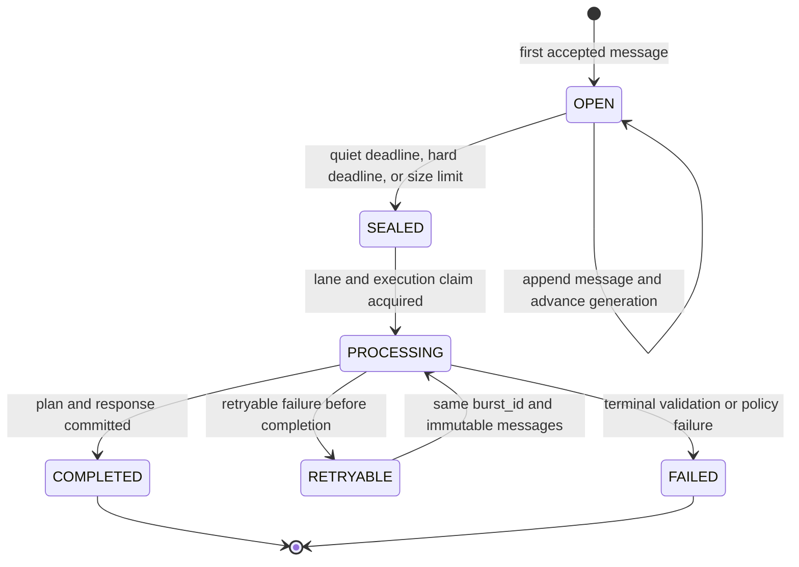

# Technical Design — Multi-Message Bursts as One Logical Turn

| Field | Value |
| --- | --- |
| Status | Draft |
| Owner | TBD |
| Reviewers | Runtime, channel-adapter, and operations owners |
| Created | 2026-07-21 |
| Last updated | 2026-07-21 |
| Expected size | Medium, approximately 2–3 engineering weeks |

## 1. Summary

The system will collect rapid inbound messages from the same user into an
ordered, immutable burst and submit that burst to the runtime as one logical
turn. The runtime will classify, extract, transition the event plan, search,
compose, and persist exactly once for the logical turn, producing at most one
outbound response.

Burst collection remains an adapter responsibility. The core runtime becomes
burst-aware through a channel-agnostic ordered-message contract. Runtime state
mutations are serialized per conversation and protected with optimistic plan
revisions and stable burst idempotency records.

Existing persisted plans will not be discarded, reset, or silently interpreted
as new plans. A bounded, one-time migration will add schema metadata and a
revision to every existing `PLAN` item while preserving its `plan_id`, OpenAI
`conversation_id`, current node, provider needs, shortlist, selections,
contact data, conversation summary, and timestamps. The migration compatibility
logic will live only in the migration utility, not as a permanent runtime shim.

## 2. Context

The deployed Lambda currently accepts one text message and maps it directly to
one `AgentService.handleTurn` invocation. The plan is loaded by `(channel,
externalUserId)`, the message is extracted, the state machine advances, a reply
is composed, and the resulting plan is written back to DynamoDB.

This is correct for clients that submit complete turns. It is not correct for
WhatsApp behavior where users commonly split one thought across several sends,
for example:

1. `Es para una boda`
2. `Seremos 80 personas`
3. `En Lima`
4. `Ah, y el presupuesto es medio`

Processing these independently can produce premature questions, unnecessary
model calls, repeated provider searches, multiple assistant messages, and lost
plan updates when Lambda invocations overlap.

The current plan store also performs an unconditional full-item write. Two
concurrent turns can read the same plan revision and then overwrite one another.
Conversation takeover and resume requests mutate the same plan and therefore
participate in the same concurrency risk.

## 3. Problem Statement and Motivation

### Problems to solve

- A natural multi-message thought is treated as several independent turns.
- The assistant can respond before the user finishes providing context.
- Each fragment can trigger classifier, extraction, search, and reply model
  calls, increasing latency and cost.
- Concurrent turns can overwrite plan changes because plan writes are not
  conditional.
- A retried burst can be executed more than once because the runtime does not
  currently enforce `message_id` or turn idempotency.
- Concatenating text would lose message identity, ordering evidence, original
  timestamps, and correction semantics.

### Desired user outcome

The four example messages above should be understood together and should lead
to one response based on the complete event context.

## 4. Goals

- Produce at most one automated response for one sealed burst.
- Preserve each native message id, text, and receive timestamp.
- Apply all messages in chronological order as one state-machine turn.
- Let later explicit corrections in a burst override earlier statements.
- Prevent concurrent mutations for the same conversation.
- Make retries idempotent with a stable `burst_id`.
- Preserve every valid existing plan and its OpenAI conversation continuity.
- Keep WhatsApp timing, webhook, delivery, and retry behavior in the adapter.
- Keep the core runtime channel-agnostic.
- Add complete traceability for aggregation latency and burst composition.

## 5. Non-Goals

- Streaming partial assistant responses.
- Cancelling an OpenAI run after a burst has been sealed.
- Inferring burst boundaries from keywords or exact message strings.
- Combining messages from different users, channels, or adapter sessions.
- Reopening an immutable burst after processing has started.
- Guaranteeing distributed exactly-once execution across OpenAI, DynamoDB, the
  Agent API, and the channel delivery API. The design provides idempotent local
  state and at-least-once recovery at external boundaries.
- Changing event-plan domain behavior unrelated to turn aggregation.
- Preserving the old single-message HTTP body indefinitely.

## 6. Terminology

| Term | Definition |
| --- | --- |
| Message | One channel-native user send with its own id and timestamp. |
| Burst key | The aggregation key: channel, external user id, and optional adapter session id. |
| Lane | The plan-mutation serialization key: channel and external user id. |
| Burst | One or more ordered messages coupled into one logical user turn. |
| Open burst | A mutable burst still accepting messages. |
| Sealed burst | An immutable burst whose membership is final. |
| Processing burst | A sealed burst currently executing in the runtime. |
| Late arrival | A message accepted after the previous burst was sealed. |
| Quiet deadline | The time after the latest accepted message when the burst may seal. |
| Hard deadline | The maximum time after the first accepted message when the burst must seal. |

## 7. Architectural Decisions

### 7.1 Adapter collection, runtime interpretation

The channel adapter owns burst timing because timing expectations differ by
channel. The runtime accepts a completed ordered burst and treats it as one
logical turn. The runtime never sleeps while waiting for more messages.

### 7.2 Messages are coupled, not concatenated

The adapter sends an ordered array. Message boundaries, ids, and timestamps are
preserved. The runtime builds a structured Spanish model input from that array;
it does not flatten the messages into an ambiguous newline-delimited string.

### 7.3 Deterministic boundaries

Burst membership depends only on trusted identity, adapter session, ingestion
time, burst state, configured time windows, and size limits. Conversational
content is never inspected to determine whether messages belong together.

### 7.4 Immutable sealing

Once a burst is sealed, its message membership cannot change. This gives the
runtime, traces, retries, and delivery adapter a stable idempotency unit.

### 7.5 Per-conversation serialization

Only one state-mutating operation may execute for a lane at a time. Message
bursts, conversation takeover, and automated-agent resume all use the same lane
coordinator.

### 7.6 Migration instead of a permanent compatibility shim

Existing plan rows are migrated in place. A dedicated migration schema knows
how to read the old unversioned plan. The normal post-cutover runtime requires
the new plan version and does not retain indefinite dual-schema branches.

## 8. Architecture

```mermaid
flowchart LR
    META["Channel webhook"] --> INGRESS["Authenticated adapter ingress"]
    INGRESS --> DEDUPE{"Native message id already accepted?"}
    DEDUPE -->|"Yes"| ACK["Acknowledge without adding it again"]
    DEDUPE -->|"No"| STORE["Persist message and update open burst"]
    STORE --> TIMER["Publish delayed flush candidate"]
    STORE --> ACK
    TIMER --> CHECK{"Latest generation and deadline reached?"}
    CHECK -->|"No"| DONE["Discard stale candidate or reschedule"]
    CHECK -->|"Yes"| SEAL["Atomically seal immutable burst"]
    SEAL --> LANE["Acquire conversation lane"]
    LANE --> RUNTIME["Runtime handles one ordered logical turn"]
    RUNTIME --> PLAN["Conditional plan save and completed-turn record"]
    PLAN --> DELIVERY{"Delivery action"}
    DELIVERY -->|"send"| CHANNEL["Send one channel response"]
    DELIVERY -->|"suppress"| COMPLETE["Complete without outbound message"]
    CHANNEL --> COMPLETE
```



### Component responsibilities

| Component | Responsibility |
| --- | --- |
| Adapter ingress | Verify webhook, normalize identity, deduplicate native messages, acknowledge quickly. |
| Burst coordinator | Maintain open burst state, calculate deadlines, reject stale flush candidates, and seal bursts. |
| Conversation lane | Serialize all plan mutations for one channel user/session. |
| Runtime handler | Validate the ordered burst contract and enforce burst idempotency. |
| Agent service | Reduce the complete burst into one state-machine transition and one response. |
| Plan store | Read and conditionally save versioned plans. |
| Turn execution store | Record processing/completed burst state and cache the response for retries. |
| Delivery worker | Deliver one response and track channel delivery status. |

## 9. Exact Message-Coupling Rules

### 9.1 Burst key and mutation lane

Two messages can be coupled only when all of the following match:

- normalized `channel`;
- normalized `user_id`;
- adapter `session_id`, when the adapter supplies one.

If `session_id` is absent, the burst key is `(channel, user_id)`. A session change
always starts a new burst. This aggregation identity is the burst key.
`contact_phone` is context and validation data; it is not part of the burst key.

The mutation lane is always `(channel, user_id)` and deliberately excludes
`session_id`, because durable plans are keyed by channel and external user. A
user therefore cannot mutate the same plan concurrently through two adapter
sessions even though those sessions create separate bursts.

### 9.2 Default WhatsApp timing

| Setting | Default | Meaning |
| --- | ---: | --- |
| Single-message grace | 10 seconds | A one-message burst waits this long for a possible continuation. |
| Confirmed-burst quiet window | 15 seconds | After a second message joins, sealing waits for 15 seconds of silence after every new message. |
| Hard burst age | 60 seconds | A burst seals no later than 60 seconds after its first accepted message. |

These are adapter configuration values, not runtime constants. Suggested
initial channel policies are:

| Channel | Single-message grace | Confirmed quiet window | Hard age |
| --- | ---: | ---: | ---: |
| WhatsApp | 10 s | 15 s | 60 s |
| Web chat | 2 s | 4 s | 15 s |
| Terminal | 0 s | 0 s | 0 s |
| Offline/live eval | Explicit fixture behavior | Explicit fixture behavior | Explicit fixture behavior |

The longer WhatsApp window recognizes that users may pause while typing several
short messages. The adaptive distinction avoids imposing the full 15-second
quiet period on every single-message turn.

### 9.3 Coupling algorithm

For each newly accepted, non-duplicate message:

1. Resolve the burst key.
2. Read that burst key's open burst, if one exists.
3. Create a new open burst when there is no open burst, when the prior burst is
   sealed/processing/completed, or when adding the message would exceed a hard
   size limit.
4. Otherwise append the message to the existing open burst.
5. Assign a monotonically increasing ingestion sequence inside the burst.
6. On the first message, set the quiet deadline to `accepted_at + 10 seconds`.
7. On the second message, mark the burst as confirmed and set the quiet
   deadline to `accepted_at + 15 seconds`.
8. On each later message, reset the quiet deadline to `accepted_at + 15
   seconds`.
9. Never move the hard deadline beyond `first_accepted_at + 60 seconds`.
10. Publish a delayed flush candidate containing the burst id and its current
    generation.
11. A flush candidate may seal the burst only when its generation is still
    current and either the quiet deadline or hard deadline has been reached.

Each appended message increments the generation, so previously scheduled flush
candidates become stale and cannot prematurely seal the burst.

### 9.4 Ordering

Burst membership uses adapter acceptance time so malformed or delayed channel
timestamps cannot extend or rewrite the window. Model-visible ordering uses:

1. channel `received_at` when valid;
2. adapter ingestion sequence as the tie-breaker and fallback.

The original timestamp and ingestion sequence are both retained in telemetry.

### 9.5 Duplicate messages

A native message id can be accepted only once per channel. A duplicate webhook
delivery acknowledges successfully but neither appends the message nor changes
the quiet deadline. This prevents retries from artificially extending a burst.

### 9.6 Size boundaries

Initial safety limits:

- maximum 20 messages per burst;
- maximum 12,000 Unicode characters across all message texts;
- maximum request body within the Lambda Function URL and application limits.

Reaching a message or character limit seals the current burst immediately. The
overflowing message starts the next burst; it is never dropped.

### 9.7 Messages arriving during processing

A sealed burst is immutable. A new message accepted while that burst is
processing creates or joins `next_open_burst` for the same lane. The next burst
cannot begin runtime execution until the current lane operation completes.

The current response is still delivered unless its delivery action is
suppressed. Cancelling or silently hiding a response after the runtime has
mutated the plan would make persisted plan state and OpenAI conversation
history diverge from what the user saw.

### 9.8 Unsupported or non-user events

Delivery receipts, read receipts, status callbacks, and unsupported channel
events never join a burst. Supported media must first be normalized by the
adapter into a typed message representation. V1 of this design accepts text
messages only.

## 10. Burst Lifecycle



Allowed states are `open`, `sealed`, `processing`, `retryable`, `completed`, and
`failed`. State transitions use conditional DynamoDB writes. No transition may
move a burst back to `open` after sealing.

## 11. Runtime Request and Response Contract

### 11.1 Request

The message endpoint will accept one logical turn:

```json
{
  "burst_id": "01K0BURSTEXAMPLE",
  "messages": [
    {
      "message_id": "wamid.1",
      "text": "Es para una boda",
      "received_at": "2026-07-21T20:00:00.000Z"
    },
    {
      "message_id": "wamid.2",
      "text": "Seremos 80 personas",
      "received_at": "2026-07-21T20:00:04.000Z"
    },
    {
      "message_id": "wamid.3",
      "text": "En Lima; en realidad serán 90",
      "received_at": "2026-07-21T20:00:10.000Z"
    }
  ],
  "user_id": "whatsapp:51999999999",
  "channel": "whatsapp",
  "contact_phone": "+51999999999",
  "session_id": "whatsapp-session-example",
  "client_mode": "channel"
}
```

Contract rules:

- `burst_id` is required and stable across runtime retries.
- `messages` is a non-empty ordered array.
- Every `message_id` is required and unique inside the request.
- Every message has its own `received_at`.
- Identity, phone, session, and client mode remain turn-level fields.
- The old flat `text`, `message_id`, and `received_at` request is removed at the
  coordinated cutover instead of being retained as a permanent union schema.

### 11.2 Response

```json
{
  "burst_id": "01K0BURSTEXAMPLE",
  "consumed_message_ids": ["wamid.1", "wamid.2", "wamid.3"],
  "message": "Perfecto, entonces es una boda para 90 personas en Lima...",
  "delivery": {
    "action": "send",
    "reason": "reply_composed"
  },
  "conversation_id": "conv_example",
  "plan_id": "01K0PLANEXAMPLE",
  "current_node": "elicitacion_necesidades"
}
```

The adapter must confirm that `burst_id` and `consumed_message_ids` match the
sealed job before delivery. A duplicate completed request returns the cached
response envelope without invoking the models again.

### 11.3 Busy response

If another state mutation owns the conversation lane, the endpoint returns a
retryable conflict response with a bounded `Retry-After` value. The adapter
retries the same immutable burst and `burst_id`; it never creates a new logical
turn for the retry.

## 12. Runtime Domain Contract

The core input becomes a normalized logical turn containing:

- channel and external user identity;
- stable burst id;
- a non-empty readonly ordered message collection;
- optional session id;
- optional trusted channel phone context.

The single-message `text`, `messageId`, and `receivedAt` fields are replaced by
the collection. A derived model-facing representation may be created only at
the runtime boundary; it is not persisted as the source of truth.

## 13. Model and State-Machine Behavior

### 13.1 One execution per burst

For one sealed burst, the runtime performs at most:

- one conversation-history read;
- one response-classification call;
- one extraction call;
- one deterministic state decision;
- the provider operations required by that decision;
- one reply-composition call;
- one plan commit;
- one outbound delivery decision.

Individual messages are never independently reduced into the plan.

### 13.2 Model-visible representation

The extractor, classifier, and reply composer receive a structured JSON array
inside Spanish conversational instructions. Example:

```text
Mensajes del usuario en este turno, ordenados cronológicamente:
[
  {"indice":1,"mensaje":"Es para una boda","recibido_en":"2026-07-21T20:00:00.000Z"},
  {"indice":2,"mensaje":"Seremos 80 personas","recibido_en":"2026-07-21T20:00:04.000Z"},
  {"indice":3,"mensaje":"En realidad serán 90","recibido_en":"2026-07-21T20:00:10.000Z"}
]
```

Message ids are not needed by the models and remain outside model-visible text.

### 13.3 Extraction semantics

The Spanish extractor conflict rules will explicitly state:

- all array entries belong to one user turn;
- interpret them together before choosing intent or producing updates;
- later explicit corrections override earlier values in the same burst;
- later ambiguity does not erase earlier clear evidence;
- preserve all compatible facts across messages;
- preserve multi-intent evidence across the whole burst;
- do not produce separate plans or separate replies for array entries.

The latest-message rule is evidence-based and implemented through structured
LLM extraction. Deterministic code validates ordering and invariants but does
not use keywords or exact strings to decide conversational meaning.

### 13.4 Response classification

Classification evaluates the complete burst. The burst may be suppressed only
when the structured classifier concludes that the complete logical turn does
not require a response. An acknowledgement followed by a question must not be
suppressed merely because the first message is an acknowledgement.

### 13.5 Reply composition

The reply agent receives the complete logical turn, the one structured
extraction, and the post-reduction plan. It produces one structured outbound
message addressing all actionable parts of the burst without narrating each
message separately.

### 13.6 OpenAI conversation continuity

Each burst is appended to the existing OpenAI conversation as one logical user
turn followed by one assistant output. Existing `conversation_id` values are
preserved by migration, so active plans continue their current session rather
than starting over.

## 14. Agent API Conversation Logging

The external Agent API remains an audit/history source for individual channel
messages. For a burst:

1. Read recent history once.
2. Pass that prior history plus the current in-memory ordered burst to the
   classifier; do not depend on immediate read-after-write behavior.
3. Log every constituent inbound message separately, preserving native message
   id and original timestamp.
4. Log the one outbound response once when outbound logging is enabled.

Failure to log one constituent message remains observable but must not split
the burst or cause multiple assistant replies.

## 15. Persistence Design

### 15.1 Existing plans table

The `PLAN` item gains:

| Field | Type | Purpose |
| --- | --- | --- |
| `schema_version` | integer | Required plan schema version after cutover. |
| `revision` | integer | Optimistic concurrency revision. |

No burst message bodies are added to the durable plan snapshot. Burst execution
data has a different lifecycle and belongs in a separate control table.

### 15.2 Conversation control table

A runtime-owned DynamoDB table stores lane and execution records:

| Record | Key shape | Important fields |
| --- | --- | --- |
| Lane lease | conversation identity + `LANE` | owner request id, operation type, lease expiry, acquired time |
| Turn execution | conversation identity + `TURN#<burst_id>` | status, message id hashes, request hash, response envelope, trace id, timestamps, TTL |
| Ownership execution | conversation identity + `CONTROL#<request_id>` | operation, status, resulting node, timestamps, TTL |

The control table uses encryption at rest and TTL for execution metadata. An
initial seven-day completed-execution retention supports webhook and network
retries without becoming indefinite conversation storage.

### 15.3 Adapter burst table

The adapter-owned burst table stores:

- one lane state record;
- one burst metadata record;
- one item per native message;
- generation and deadlines;
- processing and delivery status;
- short retention TTL after completion.

Individual message items avoid DynamoDB's single-item size limit and allow
stable ordering and deduplication. Raw message text should be retained only as
long as required for processing and bounded operational recovery.

### 15.4 Plan save semantics

A plan save requires the expected revision. On success, the revision increments
by one. A revision conflict means the caller did not operate on the latest plan
and its response must not be delivered.

The lane lease is the primary serialization mechanism. The plan revision is a
defense-in-depth invariant that detects bypasses, expired leases, and future
callers that fail to use the lane correctly.

## 16. Idempotency and Failure Semantics

### 16.1 Adapter idempotency

- Native `message_id` deduplicates webhook retries.
- `burst_id` identifies the sealed logical turn.
- The same sealed burst is retried without changing membership or ordering.
- Channel delivery uses the burst id as its idempotency/correlation key where
  supported.

### 16.2 Runtime idempotency

On request:

- a completed matching `burst_id` returns its cached response;
- a processing matching `burst_id` returns a retryable busy response;
- a matching `burst_id` with a different request hash is rejected as an
  idempotency conflict;
- a new `burst_id` may execute only after acquiring the lane.

### 16.3 Lease expiry

The lane lease lasts longer than the Lambda timeout and records an explicit
expiry. A crashed invocation cannot block the conversation indefinitely. A
recovery worker may reclaim an expired lease only when the associated execution
is not completed.

### 16.4 External side effects

OpenAI conversation writes and provider/Agent API calls cannot participate in a
DynamoDB transaction. The design minimizes duplicate effects with lane leases,
stable execution records, and cached completion. It does not claim impossible
global exactly-once guarantees.

## 17. Existing Plan Migration

### 17.1 Migration objective

Convert every existing unversioned `PLAN` row to the required version without
changing its conversational or event-planning meaning.

### 17.2 Version mapping

Existing rows are treated as migration-source version 1. The migrated row is
version 2:

- set `schema_version = 2`;
- set `revision = 1`;
- preserve `plan_id`;
- preserve `conversation_id`;
- preserve `current_node` and lifecycle state;
- preserve every event, need, shortlist, selection, contact, escalation,
  health, summary, and open-question field;
- preserve `updated_at` rather than making the migration look like a user turn;
- preserve the DynamoDB partition and sort keys.

No existing plan receives a `burst_id`. Burst execution begins only for new
post-cutover turns.

### 17.3 Migration implementation

The migration utility has explicit source and target schemas. It scans only
items whose sort key is `PLAN`, transforms one row at a time, validates the
target schema, and writes with a condition that prevents overwriting a row that
was already migrated or concurrently changed.

It supports:

- dry-run inventory;
- paginated scans;
- bounded write concurrency;
- resumability;
- per-row validation failures without hiding them;
- input/output counts;
- domain-field checksums before and after transformation;
- a machine-readable result artifact that contains identifiers and statuses,
  not message text or contact data.

### 17.4 Recommended cutover without a long-lived shim

1. Add point-in-time recovery to the plans table through CloudFormation.
2. Rehearse the migration against a development/staging copy.
3. Deploy adapter burst storage and queues with dispatch disabled.
4. Deploy the new runtime/control-table infrastructure without directing
   production adapter traffic to the new contract.
5. Pause message dispatch and ownership mutations. Continue accepting and
   durably storing inbound webhook messages in the adapter.
6. Wait for active Lambda invocations and conversation leases to drain.
7. Take an on-demand plans-table backup and record the row count.
8. Run the production migration dry run and resolve every invalid row.
9. Run the migration and validate counts, target-schema parsing, domain-field
   checksums, and a representative sample of active plans.
10. Activate the runtime release that requires plan version 2 and the burst
    request contract.
11. Switch the adapter worker to sealed-burst dispatch.
12. Resume queued message processing gradually and monitor migration and burst
    metrics.

This creates a short dispatch delay rather than maintaining two plan schemas in
the runtime. Webhook ingress remains available during the cutover.

### 17.5 Zero-dispatch-pause alternative

If even a short dispatch pause is unacceptable, use a two-release bridge:

1. A temporary release reads unversioned and version-2 plans but always writes
   version 2.
2. Migrate all remaining rows and verify that no unversioned rows remain.
3. Deploy the strict version-2 runtime and remove the bridge immediately.

This is a bounded migration bridge with an explicit removal gate, not an
indefinite compatibility layer. The paused-dispatch approach is preferred for
this project because it is simpler to reason about and test.

### 17.6 Request-contract cutover

Plan migration and request migration are coordinated but independent. Existing
plans survive the request change. The terminal client, live eval target, and
channel adapter are updated to send `burst_id` and `messages[]` before dispatch
resumes.

## 18. Infrastructure Changes

All infrastructure changes use CloudFormation.

Required resources or properties:

- point-in-time recovery for the plans table;
- runtime conversation-control DynamoDB table with TTL;
- adapter burst DynamoDB table with TTL;
- standard SQS delayed flush-candidate queue;
- dead-letter queue for exhausted flush/processing failures;
- permissions for conditional DynamoDB operations, queries, updates, and
  transactional writes where required;
- alarms for queue age, dead letters, migration failures, and runtime conflict
  rates.

Standard SQS is used for delayed flush candidates because individual-message
timers are required. Ordering comes from persisted burst sequence and
conditional burst/lane state, not from queue delivery order.

## 19. Configuration

Typed adapter configuration:

| Configuration | WhatsApp default |
| --- | ---: |
| Single-message grace | 10,000 ms |
| Confirmed-burst quiet window | 15,000 ms |
| Maximum burst age | 60,000 ms |
| Maximum messages | 20 |
| Maximum characters | 12,000 |
| Completed adapter burst retention | 24 hours initially |
| Completed runtime execution retention | 7 days initially |

Configuration validation enforces positive values and requires:

- single-message grace less than hard age;
- confirmed quiet window less than hard age;
- safe upper bounds that cannot approach Lambda timeout through waiting, since
  the runtime never performs the wait itself.

## 20. Observability

### 20.1 Burst metrics

| Metric | Purpose |
| --- | --- |
| Burst count | Number of logical turns processed. |
| Messages per burst | Distribution of aggregation effectiveness. |
| Single-message burst ratio | Detect over-waiting without aggregation benefit. |
| Quiet-sealed versus hard-sealed ratio | Tune timing and detect never-ending bursts. |
| Aggregation wait p50/p95/p99 | Measure user-visible delay introduced before runtime. |
| Late arrivals after seal | Measure window insufficiency. |
| Duplicate inbound messages | Validate webhook retry behavior. |
| Stale flush candidates | Validate generation-based debounce behavior. |
| Lane contention and lease expiry | Detect concurrency defects and slow turns. |
| Cached idempotent responses | Confirm safe retry handling. |
| Plan revision conflicts | Detect serialization bypasses. |

### 20.2 Trace fields

One logical turn trace adds:

- burst id;
- message count;
- ordered message-id hashes;
- first and last received timestamps;
- first and last adapter acceptance timestamps;
- burst aggregation wait;
- seal reason;
- idempotency disposition;
- lane wait and lease owner correlation;
- plan revision before and after.

Raw user text, phone numbers, bearer tokens, and unredacted user identity must
not be added to operational logs.

### 20.3 Initial alert candidates

- oldest sealed burst awaiting processing exceeds two minutes;
- dead-letter queue contains any item;
- plan revision conflicts exceed a small sustained baseline;
- lane leases expire repeatedly;
- runtime error rate increases materially after cutover;
- hard-deadline seals exceed 10% of confirmed bursts;
- late arrivals exceed 10% of completed WhatsApp bursts.

Thresholds should be adjusted after a one-week observation period.

## 21. Security and Privacy

- Preserve existing Bearer authentication for adapter-to-runtime calls.
- Continue verifying the original channel webhook signature in the adapter.
- Encrypt DynamoDB and SQS data at rest using AWS-managed or project-approved
  KMS keys.
- Store raw inbound text only in the adapter burst table for the minimum
  operational retention required.
- Store hashes rather than raw message ids in CloudWatch and aggregate traces
  unless a durable support requirement explicitly needs the raw id.
- Do not expose plan, trace, burst membership, or idempotency metadata to the
  end user.
- Enforce message-count, text-size, request-size, and lane-rate limits before
  model invocation.
- Do not log model-visible burst JSON because it contains user content.
- Keep channel delivery credentials out of the channel-agnostic runtime.

## 22. Testing Strategy

### 22.1 Unit tests

- First message creates an open burst with the single-message deadline.
- Second message before sealing confirms the burst and applies the longer quiet
  window.
- Every later message advances generation and resets only the quiet deadline.
- Hard deadline never moves.
- Stale flush candidates cannot seal a burst.
- Duplicate native ids do not append or extend deadlines.
- Size boundaries seal and roll overflow into the next burst.
- Sealed membership is immutable.
- Ordering uses received time and ingestion sequence deterministically.
- Conditional plan writes increment revision and reject stale revisions.
- Completed `burst_id` returns the cached response.
- Same `burst_id` with different message content is rejected.

### 22.2 Agent-service tests

- Complementary messages produce one extraction and one reply.
- An explicit correction in the final message wins over an earlier value.
- Compatible facts from all messages survive plan reduction.
- An acknowledgement followed by a question is not suppressed.
- Several acknowledgements after an outbound message may be suppressed once.
- A multi-intent burst preserves provider selection and opens the next need.
- One burst performs at most one provider-search decision per logical turn.
- Every constituent inbound message is logged separately to the Agent API.
- The outbound response is logged once.

### 22.3 Concurrency and integration tests

- Two users process concurrently without sharing a lane.
- Two bursts for one user execute serially and preserve both plan updates.
- A message arriving during processing creates the next open burst.
- Takeover racing with a burst is serialized and cannot be overwritten.
- Resume racing with a burst is serialized.
- Lambda timeout followed by retry uses the same burst execution record.
- Duplicate SQS delivery does not duplicate runtime execution or channel
  delivery.
- Agent API logging failure does not split or lose the burst.

### 22.4 Migration tests

- Every representative legacy plan fixture transforms to version 2.
- Plan id, conversation id, current node, needs, recommendations, selections,
  contact state, escalation state, and update timestamp remain equal.
- Re-running migration is safe.
- A concurrently changed row is skipped and reported rather than overwritten.
- Invalid source rows are isolated and reported.
- The strict post-migration runtime rejects an unversioned row in tests.

### 22.5 Evaluation cases

Add burst-specific offline and live cases such as:

1. Event type, guest count, and location split across messages.
2. `80 personas` followed by `en realidad 90`.
3. Provider selection followed by a new provider need.
4. Acknowledgement followed by a substantive question.
5. Several short messages that should yield one recommendation response.
6. A message arriving after seal that must become a new turn.

Evaluation assertions should target structured extraction, plan state, node
transition, tool calls, response count, and delivery action rather than exact
prose.

## 23. Rollout Plan

### Phase 0 — Baseline and decisions

- Confirm adapter ownership and deployment repository.
- Measure current inter-message gaps from available channel telemetry.
- Confirm the initial 10-second, 15-second, and 60-second values.
- Confirm maintenance-window versus temporary bridge migration.
- Assign owner and reviewers.

### Phase 1 — Domain contract and pure aggregation logic

- Define burst and normalized logical-turn types.
- Implement deterministic coupling and lifecycle rules behind unit-tested
  interfaces.
- Define the new request and response schemas.
- Update terminal and eval fixture contracts.

### Phase 2 — Runtime concurrency and idempotency

- Add the conversation control table through CloudFormation.
- Add lane acquisition/release around message, takeover, and resume mutations.
- Add stable burst execution records and cached response replay.
- Add plan revision and conditional persistence.
- Add conflict and retry response contracts.

### Phase 3 — Burst-aware agent flow

- Replace scalar inbound text with the ordered message collection.
- Update classifier, extractor, close/contact validation, summary, and reply
  inputs to consume one derived logical turn.
- Update Spanish prompt files with within-burst ordering and correction rules.
- Log constituent Agent API messages separately.
- Extend traces and perf records.

### Phase 4 — Adapter aggregation

- Add adapter burst persistence and delayed flush candidates.
- Add generation checks, sealing, processing, and delivery state.
- Dispatch one sealed burst to the runtime.
- Implement stable retry and dead-letter behavior.
- Add channel-specific timing configuration.

### Phase 5 — Migration tooling and rehearsal

- Add version-1 source and version-2 target migration schemas.
- Add dry-run, resumable transform, conditional writes, and validation report.
- Rehearse on a development/staging table copy.
- Validate rollback from backup and re-run behavior.

### Phase 6 — Development deployment and validation

- Deploy all Lambda-impacting runtime, prompt, dependency, and CloudFormation
  changes to development.
- Run typecheck, lint, unit, integration, eval, and live smoke gates.
- Exercise real multi-message timing through the development adapter.
- Tune windows based on observed late-arrival and single-message-wait metrics.

### Phase 7 — Production migration and controlled release

- Provision backups and control resources.
- Pause dispatch, drain active work, and migrate existing plans.
- Activate the new runtime contract and updated adapter worker.
- Resume a small portion of queued work, then ramp to full processing.
- Observe errors, conflicts, queue age, aggregation wait, and response counts.

### Phase 8 — Cleanup

- Remove any temporary migration bridge if the zero-pause alternative was used.
- Remove migration-only permissions after verification.
- Retain the migration report and design decisions.
- Update channel integration, evaluation, and operations documentation.

## 24. Estimated Work Breakdown

| Workstream | Estimate |
| --- | ---: |
| Contract, domain types, and pure coupling tests | 2–3 days |
| Runtime lane, idempotency, and conditional plan persistence | 3–4 days |
| Burst-aware classifier/extractor/reply flow and prompts | 2–3 days |
| Adapter persistence, queueing, sealing, and delivery | 3–5 days |
| Migration utility, rehearsal, and validation | 2–3 days |
| Evals, observability, documentation, and rollout | 2–3 days |
| Total | Approximately 14–21 engineering days |

The estimate assumes the production WhatsApp adapter is accessible and already
has durable queueing. If that adapter or its infrastructure must be created
from scratch, its work should be estimated separately.

## 25. Risks

| Risk | Impact | Probability | Mitigation |
| --- | --- | --- | --- |
| Longer wait makes single-message responses feel slow | Medium | Medium | Adaptive 10-second single-message grace; measure and tune by channel. |
| Window is still too short for some users | Medium | Medium | 15-second confirmed quiet window, 60-second hard age, and late-arrival metric. |
| Continuous messages delay a reply too long | Medium | Low | Immutable 60-second hard deadline and size caps. |
| Duplicate or out-of-order queue delivery corrupts bursts | High | Medium | Durable sequence, generation checks, conditional state transitions, and idempotency. |
| Concurrent plan writes lose state | High | Medium | Shared lane for all mutations plus plan revisions. |
| Migration changes existing plan meaning | High | Low | Preserve domain fields, checksum validation, staging rehearsal, backup, and sampled comparison. |
| Runtime retry duplicates an external side effect | High | Low/Medium | Stable execution record, cached response, lane lease, and side-effect tracing. |
| Raw message retention expands PII footprint | High | Medium | Separate short-lived adapter storage, TTL, encryption, and redacted logs. |
| New message arrives while a response is being generated | Medium | Medium | Put it in the next immutable burst and serialize delivery order. |
| Takeover races with an agent turn | High | Low/Medium | Route ownership operations through the same lane. |

## 26. Rollback Plan

### Rollback triggers

- Any evidence of lost or reset existing plans.
- Material increase in duplicate assistant responses.
- Sustained plan revision conflicts or lane lease expiry.
- Dead-letter accumulation or sealed-burst queue age beyond the operational
  threshold.
- Material increase in runtime error rate.
- Incorrect message membership or cross-user coupling.

### Application rollback

1. Pause burst dispatch while continuing durable webhook acceptance.
2. Stop the new adapter worker from sending the burst contract.
3. Revert runtime and adapter releases together.
4. Resume the former one-message dispatch path only after confirming request
   compatibility.
5. Reprocess undelivered adapter records according to their original native ids.

### Data rollback

The version-2 additions are metadata fields; domain plan fields are preserved.
The previous runtime ignores unknown fields when reading. If it later rewrites a
plan, it may remove migration metadata but still retains the domain plan. A
future rollout can safely rerun the migration.

If domain validation detects corruption, restore affected plan rows from the
pre-migration backup before resuming dispatch. Do not restore the entire table
when only a bounded set of rows is affected.

### Infrastructure rollback

Keep new control and burst tables during rollback until all queued or processing
records are reconciled. Removing them immediately would destroy recovery and
idempotency evidence. Decommission only after the incident is resolved.

## 27. Success Metrics

Initial success criteria for the first two weeks:

- zero migrated plans lost, reset, or assigned a new plan id;
- zero cross-user or cross-session burst coupling incidents;
- zero plan updates lost in concurrency tests and production evidence;
- fewer than 1% duplicate runtime executions for the same burst, with zero
  duplicate channel deliveries;
- at least 95% of confirmed WhatsApp bursts seal through quiet time rather than
  the hard deadline;
- late-arrival rate below 10%, then tuned downward using real data;
- reduced model calls per inbound channel message for users who send bursts;
- one outbound automated response for every successfully processed burst unless
  delivery is explicitly suppressed;
- no material regression in end-to-end completion or user feedback.

## 28. Alternatives Considered

### Concatenate messages only in the adapter

Rejected as the target design because it loses message ids, timestamps,
boundaries, correction evidence, and per-message audit logging. It also does not
solve plan concurrency or runtime idempotency.

### Wait inside the runtime Lambda

Rejected because it wastes Lambda duration, cannot observe future webhook
requests safely, couples core behavior to channel timing, and still requires
shared storage and coordination.

### Process every message and suppress intermediate replies

Rejected because each fragment can still mutate the plan, invoke tools, append
OpenAI conversation history, and race with other fragments. Suppressing
delivery does not undo those effects.

### SQS batching window alone

Rejected because queue batching is not a per-conversation quiet-period
contract. A batch can mix users and does not reliably express "15 seconds since
this user's latest message."

### Permanent old/new request and plan unions

Rejected because the project is in active development and permanent
compatibility branches increase ambiguity and testing cost. Existing plan data
is protected through explicit migration instead.

## 29. Open Questions

| Question | Recommended default | Owner |
| --- | --- | --- |
| Who owns the production channel adapter work? | Assign before Phase 1 completion. | TBD |
| Is a short dispatch pause acceptable for plan migration? | Yes; prefer it over a dual-schema runtime. | Product/operations |
| Are 10 s / 15 s / 60 s acceptable initial WhatsApp windows? | Yes, then tune from late-arrival telemetry. | Product/runtime |
| How long may raw burst text remain in adapter storage? | 24 hours after completion. | Security/operations |
| Should web chat expose a client-side explicit "send" boundary? | Consider later; keep V1 timer-based. | Product |
| What production traffic percentage is used for the initial ramp? | Start with a small controlled cohort or adapter partition. | Operations |

## 30. Documentation and Repository Requirements

Implementation must also:

- update the channel integration contract;
- update evaluation-framework documentation and burst fixtures;
- add every prompt change under the exact `prompts/` node path;
- record every code and prompt change, reason, decision, and validation in
  `docs/implementation-log.md`;
- use strict TypeScript without explicit `any`;
- implement all infrastructure changes in CloudFormation;
- redeploy the development Lambda after each Lambda-impacting change;
- keep WhatsApp-only timing, webhook, and rendering behavior out of core runtime
  modules.

## 31. Approval Gates

Implementation may begin when the following are agreed:

- owner and reviewers are assigned;
- the lane identity and timing defaults are accepted;
- adapter repository and infrastructure ownership are known;
- maintenance-window or bridge migration strategy is selected;
- raw-message retention is approved;
- request and response contracts are approved;
- rollback and plan-integrity validation procedures are accepted.
