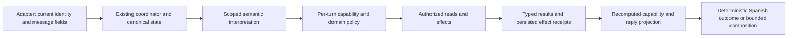

# Recap stabilization implementation plan — revision 2

Date: 2026-09-05. Canonical plan; Notion contains execution tickets only.
Baseline: `55a6c99bba6e2d1162aee071204f41aeebb8fba9`.
This revision supersedes the earlier upstream dependencies, OTP resend policy,
and implementation estimates. Implementation is authorized separately from this
planning task; the behavior and architecture decisions below are fixed.

Read [tickets.md](tickets.md) for implementation scopes, [evidence.md](evidence.md)
for historical findings, [contract-validation.md](contract-validation.md) for the
current contract check and optional upstream proposals, and
[case-matrix.csv](case-matrix.csv) for the original 59-case baseline.

## Fixed decisions

1. Implement the release entirely in this repository using existing API shapes.
   No upstream change, approval, new endpoint or new field is a release dependency.
2. Retain TypeScript, Agents SDK, Lambda, the current model, the existing turn
   coordinator and one canonical persisted conversation/event-plan aggregate.
   Extract pure policies, effect execution and reply projections within that stack.
3. Prefer trusted phone-scoped reads and existing phone authentication. When those
   cannot safely satisfy a protected request, use human help by default. OTP is an
   explicit, eligible last resort with one send and at most one verification.
4. Derive capabilities for every turn from implementation, configuration, gateway,
   environment, identity, resource state, policy and current effect results. Use the
   same projection for instructions, schema, tool exposure, execution and replies.
5. A model may interpret language and compose grounded explanations. It may not
   grant access, invent a supported action, select success without a receipt, or
   mutate state from reply tooling.
6. Freeze incident worlds for behavior regression; retain real read-only backend
   probes as a separate drift report. Change obsolete OTP expectations explicitly
   to the new product policy, retaining their incident IDs and hard gates.
7. Historical root-cause gaps are recorded evidence limitations, not open design
   decisions or blockers. Use the prescribed safe behavior for each unknown state.

## Implementation ownership

The integrator owns shared edits to `agent-service.ts`, `openai-agent-runtime.ts`,
`handler.ts`, `core/plan.ts`, prompt manifests and the behavior registry. Domain
workers own the pure modules and focused tests specified in tickets. Integrate
wiring sequentially; do not let parallel workers alter the shared service.

Keep support/FAQ/RSVP activity in the canonical aggregate without erasing the
multi-provider plan. An invitation response does not create a provider-planning
request. Retain the early automation classifier; resolve its contradictory output
through typed policy. Do not merge model stages or change models in this release.

## Local campaign and invitation behavior

The current message API exposes source, body and timestamps, but the inspected
responses do not expose event/campaign/invitation/name metadata. Use the existing
fields; no new campaign-reference wire contract is required.

Normalize `frontend_followup` and `admin_campaign` to the adapter's reminder
source category. Include relevant `admin_manual` context. Order using valid server
message timestamps and message ID as the stable tie-breaker. Have structured
semantic extraction identify reminder purpose, the literal event title, relevant
public link and explicit user topic switches. Persist this bounded narrative
context in the existing aggregate with its source message ID and provenance
`outbound_message`; it is never authoritative attendance or authorization evidence.
Do not use keyword or substring matching to select a conversational route.

For event identity, keep IDs returned by existing trusted phone lookup/detail APIs.
A semantic event reference may identify a candidate from that returned set; validate
membership and uniqueness deterministically before any action. Do not write using
an ID or URL taken only from message text. If no unique actionable invitation is
verified, keep intent unresolved and escalate through the existing human endpoint.
No extra OTP, account registration or upstream change is needed.

| Case | Required local outcome |
|---|---|
| Roberto confirms after reminders but lookup is empty/404 | Acknowledge the reminder and inability to verify its invitation now. Attempt human escalation once. Do not deny the invitation exists or claim registration. Offer only the existing trusted public assistance link if relevant. |
| Roberto with a uniquely verified actionable invitation | Execute one authorized RSVP effect and report the verified outcome. |
| Maria Paz asks what the reminder means | Explain the current reminder from outbound-message evidence, preserving the literal title. Do not dump historical/unnamed invitation records or change attendance. Escalate if she requests an action and identity is still unresolved. |
| Jose greets then acknowledges/defers | Contextual greeting, followed by suppression for an unambiguously non-actionable closure. If there is an unresolved question, give one focused contextual response. No planning interview or repeated introduction. |
| Tito adds a relationship comment after verified attendance | Preserve attendance and treat the relationship as user-reported only. A pure acknowledgement is suppressed; a substantive relationship comment gets one short acknowledgement without a new question. |
| Numeric/phone-only/ordinal CRM label | Agent-generated messages use a neutral greeting unless a verified guest name already exists in trusted detail. Never copy the label as a name or infer a name from the ordinal. |

Already-sent upstream greetings cannot be repaired locally. Fixing their sender is
an optional proposal, excluded from local release acceptance. Our acceptance is
that the agent does not repeat or propagate the bad personalization.

Missing histories produce a bounded clarification only when an actionable request
cannot be resolved. They do not trigger onboarding. Keep raw history bounded and
store no second conversational memory. Use native/record IDs already available;
when constituent IDs for a coalesced turn are absent, retain that uncertainty and
do not deduplicate distinct inbound records by body text alone. No new upstream
batch-ID requirement is imposed.

## Authentication: human-first, one OTP challenge

Implement `InformationAuthStateMachine` with persisted recovery state in the
canonical aggregate. State includes `send_attempted`, `verification_attempted`,
`terminal_reason`, the current challenge binding and preserved protected request.
Consume each attempt before its outbound call; transport retries cannot create
another OTP send/verification. Do not persist the submitted code.

Apply this exact order:

1. Execute supported public or trusted phone-scoped reads without email OTP.
2. Use existing valid authentication, or one existing phone-auth operation if the
   requested protected resource supports it and the trusted phone is available.
3. If still unresolved, attempt human help by default. Do not proactively ask for
   email or offer a resend/email-change menu.
4. Enter email OTP only when all are true: the user explicitly chooses email
   verification instead of human assistance; the requested existing account-scoped
   orders/gift-detail operation supports the resulting credential; current trusted
   account evidence identifies an existing account for this subject; email-OTP
   capability is enabled; no challenge has been attempted in this recovery episode;
   and no human takeover is already active. Unknown account eligibility fails this
   gate. A user claim of being registered is not trusted account evidence. No new
   eligibility lookup endpoint is added.
5. Use the verified account email; if it is unavailable, escalate instead of
   collecting alternative addresses. Send one challenge, then verify at most one
   submitted code. The rare OTP lane is deliberate; it is not a universal fallback.

| Outcome/turn | Next action |
|---|---|
| Send succeeds | State the send truthfully and await the code once. |
| Send fails, times out, is blocked, rate-limited, or email is not found | Terminal recovery; attempt human help. No resend. |
| First non-delivery report, resend request, email-change request or authentication refusal | Terminal recovery; attempt human help, no new code operation. |
| One validly extracted code, including number words | One verification call if the challenge is active and unattempted. |
| Invalid/expired/rejected code, verification timeout, malformed credential needing another repair turn, or unsupported account | Terminal recovery; attempt human help. No second verification. |
| Successful verification | Resume only the preserved authorized request. |
| Terminal state plus later code or request to restart | No OTP call; retain human path and original request. |

A browser/session ID change, topic switch or reset of the event plan cannot clear
the recovery budget. Preserve terminal recovery across all of them. An existing
`code_requested` state consumes the send allowance; existing failed verification
or non-delivery evidence terminates recovery. This is a one-time typed state
normalization, not a backward-compatibility implementation. There is no automatic
new recovery episode after failure. A successfully authenticated/resolved episode
can finish normally; its credential expiry does not authorize silently restarting
OTP. No scheduled reminder or background timeout message is introduced.

Update the existing resend and two-failure cases to assert immediate handoff under
this explicit user-approved policy change. Keep hard semantic judging and separate
coverage entries. Do not make the new behavior fail an obsolete resend contract.

## Dynamic capability grounding and human help

Extend `capability-manifest.ts`; do not create a parallel catalog. Configuration
availability currently exists. Add an exhaustive per-turn discriminated decision:
`executable`, `needs_input`, `unsupported`, `unavailable`, `blocked`, or
`already_completed`. Record the operation ID, reason, authorized resource scope,
required typed input, actual effect status and permitted next action. Derive it
before every model call and again after a gateway result. Never persist a stale
`can_do` assertion as conversation memory.

Execution is permitted only at the intersection of implemented operation,
configuration/feature flags, actual gateway support, environment write policy,
trusted identity/access, resource state, current request authorization, and remaining
attempt budget. Missing evidence denies execution. OTP authentication never turns
an unimplemented action into a supported one.

Split misleading write mappings: `finish_plan` requires quote-write capability;
provider favorites/reviews and phone association writes get their own effect
capabilities rather than inheriting `provider.plan` or `auth.phone`. Include OTP
send/verification in effect accounting. A read-only feature must not implicitly
enable a mutation. All tools map to an exhaustive operation descriptor.

The interpreter sees only the requested domain's operation names and relevant
boundary distinctions, sufficient to recognize an unsupported request. The reply
model sees only the selected outcome, verified facts and permitted next step. Do
not send the full capability catalog on ordinary turns. For a broad capability
question, produce a bounded deterministic list from current descriptors; distinguish
services generally supported from actions executable for this subject now.

| Requested behavior | Fixed grounding rule |
|---|---|
| Purchase status / gift detail | Read only through a currently authorized existing path; otherwise human help. |
| RSVP change | Requires verified actionable invitation and current explicit attendance decision; otherwise human help. |
| Send a confirmation document, validate payment proof, execute refund/withdrawal, modify dedication/purchase, inspect unsupported media | Unsupported in the current manifest; do not promise it. Provide an already-authorized useful read if requested, then attempt human help. |
| Human escalation | This is itself a capability/effect. Say it was requested only after confirmed endpoint success or a persisted receipt of that success. |
| Future notification or guaranteed human response time | Never promise; no supported scheduler/SLA capability exists for these claims. |

Use deterministic Spanish renderers for capability answers, unsupported outcomes,
OTP outcomes, RSVP effect results and handoff results. Their content is under
`prompts/` with exact node/outcome mapping. Bounded composition is for narrative
answers only, with no tools and a structured claim contract: action claims must
reference a matching operation/result in the turn evidence. Invalid output uses
the deterministic outcome renderer, not a second corrective model call. Keep
claim checks structural; do not add keyword-based routing or success detection.

Implement `HumanHelpPolicy` once and reuse it for authentication failures,
unsupported requests and invitation mismatch. An actionable request that cannot
be completed authorizes the application's fallback escalation; no extra menu or
confirmation loop. Use existing `POST /conversations/request-human` with the
trusted phone. Persist a local deduplication key and result. A confirmed request
soft-pauses automation; repeated turns never submit the same handoff again.

If handoff is unavailable/blocked/fails, persist `handoff_failed` or `outcome_unknown`
without marking `requested` and without a successful-takeover soft pause. Reply
truthfully that automatic referral failed; include a support link/channel only
when already verified in existing public knowledge. Otherwise state the failure
without inventing contact details, a queue, a ticket or response time. Safe public
help remains available. Do not fall back into OTP after handoff failure, and do
not automatically retry the same failed or unknown handoff. A later explicit human
request may retry a known failed handoff once for that new inbound ID; unknown
outcomes stay unretried to avoid duplicate effects.

## Other fixed domain and execution decisions

- RSVP declined-status queries offer one optional change per event/state version;
  explicit no-change and repeated queries do not re-offer. The offer is not a write.
- Purchase reconciliation preserves record identity, partition and field provenance.
  Conflicting non-null authority produces a conflict outcome; it never becomes a
  confident status selected only by source priority. Current backend status wins
  over stale test notes, not over a contradictory equally authoritative record.
- Cart and order remain distinct. Reported amounts/time/currency never become
  settlement evidence. Preserve server-local timestamps; no timezone conversion.
- Unique records are stated directly; multiple records require one usable selection.
  Unsupported mutations do not prevent a separately authorized requested safe read.
- Disclose a customer-visible transaction reference only when the existing source
  explicitly supplies it and access is authorized. With no such evidence, omit it
  and remove any judge requirement to echo it. Internal/auth identifiers stay hidden.
- Persist effect intent before execution and result before reply/delivery. The
  current inspected clients provide no idempotency-key contract: assume none.
  Disable automatic write retries. On RSVP timeout, use one authorized state read;
  report the observed state without attributing it to our write. If still unknown,
  escalate. Provider quote unknowns remain unresolved and are not retried.
- Persist per-provider quote results; partial success cannot finish unresolved
  needs. Require an explicitly captured event date before quote submission because
  the existing request requires `eventDate`; never substitute today or null.
- Keep the existing coordinator. Add lease-owner fencing to the plan save path
  using the existing DynamoDB coordination record in a conditional transaction;
  reject saves from an expired/superseded lease. No second lock store is introduced.
  Delivery retry uses the existing message identity and persisted outcome rather
  than rerunning effects. This does not claim cross-system exactly-once execution.
- Keep all test effects inside the existing fixture framework. Use an evaluation
  table namespace keyed by run/case/operation with TTL for multi-invocation simulated
  state and receipts. Production rejects fixture markers; real dev writes remain
  blocked. No fixture provider mutation forwards to the real gateway.

## Execution order

| Stage | Packages | Completion requirement |
|---|---|---|
| Foundation | S01 frozen regressions, S02 complete simulation, S16 capability/human policy, S14 local coordination | Typed contracts and exhaustive capability/effect tests; no upstream dependency. |
| Incident behavior | S04 local reminder/RSVP mismatch, S05 continuity, S06 one-shot OTP, S08 purchase reconciliation | Full local behavior specified above, including successful and failed handoff. |
| Projection and effects | S07 RSVP policy, S09 purchase replies, S10 model projection, S11 RSVP durability, S13 grading | Minimal inputs, no discarded reply calls, verified receipts and aligned expectations. |
| Completion | S12 provider completion, S15 release gate | All mandatory cases pass on the current dev artifact. |
| Optional external proposal | S03: two minimal upstream requests only | No implementation or upstream change without separate approval; excluded from all local dependencies and acceptance. |

The full dependency graph is in `ticket-index.json`. Begin foundation packages
in parallel with disjoint ownership, integrate shared wiring sequentially, and
then follow their graph. No duration estimates or calendar commitments apply.
Historical incident tracing is evidence enrichment; it cannot postpone the
specified local fallback behavior.

## Validation and release contract

For each behavior change: an atomic commit, new coverage registry entry even if
reusing a case, deterministic twin where possible, full-interaction live case in
`live_behavior_regression`, hard structural/effect assertions and hard
`text_semantic` with `requireJudge: true`. Use synthetic identities and frozen
as-of time. Keep the original 59-case report as historical evidence; explicitly
version the OTP policy cases rather than weakening or removing hard gates.

Required new capability cases: unsupported operation; feature disabled; dev write
blocked; missing identity; unknown resource; OTP exhausted; gateway failure after
an available preflight; successful handoff; failed/unknown handoff; already-requested
handoff; and cross-turn capability changes. Verify that prose cannot claim success
or offer unavailable tools and that unrelated capabilities are absent from prompts.

Measure instruction/input/schema bytes, tools, model calls, cache-aware cost and
latency by outcome. No byte growth on unaffected routes; no provider tools on
acknowledgement/clarification; no reply-model call for complete deterministic
outcomes. No model switch, fine-tuning or framework experiment is in this release.

Run focused tests, typecheck/lint, prompt audits, coverage audit, current development
CloudFormation deployment, focused live cases and complete `npm run eval:behavior-live`.
Record every trial and artifact ID in `docs/implementation-log.md`. Skips, missing
judge, evaluator errors and hard failures fail the gate. Repeat affected high-risk
families three times on identical worlds; independently review complete transcripts
for judge disagreements. Review adjudicates test evidence, not unspecified product
behavior. Optional upstream S03 acceptance is never part of this gate.

S15 prepares the identical validated S3 artifact and rollback identity for a later
explicitly authorized production promotion. Preserve production webhook, tables
and secrets. This planning revision makes no runtime change or deployment.

## Research provenance

The local evidence supports the selected ownership boundaries. External references
support bounded workflows and outcome/trajectory-based evaluation respectively:
[Building effective agents](https://www.anthropic.com/engineering/building-effective-agents)
and [Demystifying evals](https://www.anthropic.com/engineering/demystifying-evals-for-ai-agents).
They do not establish this application's incident causes. Unknown historical causes
remain documented in evidence.md; the implementation behavior for them is fixed here.
