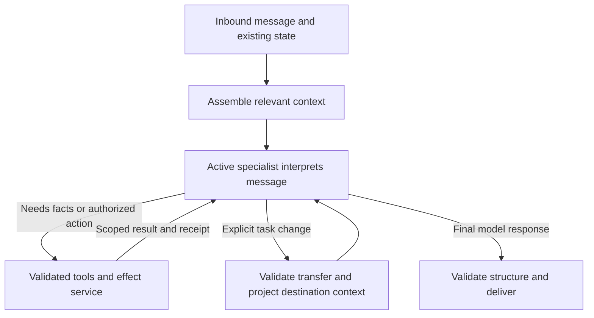

# Lean conversation architecture: implementation plan

Date: 2026-09-09. Status: proposed implementation plan; no runtime work performed by this task. Decision owner: Leonardo. Implementation ownership: one integrator for shared runtime files; no parallel edits to `agent-service.ts`. Baseline inspected: `40d3bd79`, with pre-existing work in progress. Epic/team assignment: not applicable to this repository-local plan.

## Decision and purpose

The LLM owns conversational interpretation and customer-facing language. Runtime code owns authenticated access, grounded evidence, valid effects, durable state, and transport. Assemble the smallest sufficient context for each decision. Remove competing ownership rather than adding another layer of agents or policies.

The product retains its existing event-plan-first scope: multiple provider needs within one event, purchases, invitations, FAQ/event information, support, and image evidence. WhatsApp and terminal keep the same capabilities. No new microservices, model upgrades, streaming, general-purpose memory framework, or agent per decision node. No compatibility shim. This is a refactor of existing behavior, not permission to weaken authorization, invent facts, or discard supported tasks.

The audit demonstrated broad extraction inputs, duplicated stage decisions, complete fixed replies, and post-generation replacements. In a fresh live payment-confirmation replay the model correctly returned ambiguity, while the runtime passed “clear” to the reply model. The five-turn quote flow also demonstrated why fluent final text cannot substitute for correct effect timing.

Sources: [audit](../../../analysis/agent-complexity-handoffs/findings.md), [scenario analysis](../../../analysis/agent-complexity-handoffs/scenarios.md), and the [earlier prohibition](/Users/leonardocandio/Work/thesis/recap-agent/docs/implementation-log.md:8133). The latest user instruction supersedes plans that prescribe complete deterministic responses.

## Non-negotiable acceptance contract

The [binding edit checklist and anti-gaming requirements](acceptance-contract.md) extend this plan with exact symbols, independent output/request checks, evaluator-change controls, adversarial cases and test mutations. Requirements E01–E12 and R01–R11 are release criteria, not optional advice.

1. Every delivered conversational sentence is generated by the LLM for that turn. No complete fixed replies, canned paragraphs, deterministic questions, or template-backed fallback prose. This includes successful actions, errors, unsupported capabilities, authentication failures, acknowledgements, and human escalation.
2. No generation followed by text replacement, insertion of canned fragments, or a second component deciding what the answer should say. Do not rename such behavior “grounding”, “truthfulness”, “formatting”, or “evidence”.
3. Evidence contains facts, provenance, missing inputs, unresolved alternatives, and real outcomes. It must not contain a prewritten answer or an instruction to recite a particular sentence. Genuine retrieved FAQ material is source evidence, not runtime-authored reply text.
4. Deterministic code can validate schema, authorization, entity IDs, dates/numbers already extracted, field disclosure, effect preconditions, and receipts. It cannot infer conversational intent by keywords or erase semantic ambiguity without new structured evidence.
5. Handoffs are silent internal transfers. The user continues one conversation. Actual human escalation remains a business operation with a receipt and a truthful model-written explanation.
6. Existing no-response decisions remain possible where delivery is legitimately suppressed. A model failure is an operational failure, never an acknowledgement suppression or successful reply.
7. No additional per-turn model stage merely to support the refactor. No discarded reply calls. Every new abstraction must replace an existing owner and have production callers.

Mechanical paragraph joining, transport encoding, and rendering an exact grounded link are permitted. Provider cards may format approved structured data; all conversational introductions, recommendations, explanations, labels that express an outcome, and questions remain model-written. Audit card labels individually rather than treating the entire renderer as exempt.

## Target execution

Persist a small active owner: planning, purchases, invitations, or support. Reuse existing domain state as the source of truth; do not create four independent copies of the conversation or event plan. Keep the pending question, unresolved task references, and optional return owner beside that state. Secrets and backend dependencies remain runtime-only.

An unowned conversation enters the support/entry profile, which can answer a greeting or select another owner. An established owner handles follow-ups directly and can transfer on a semantic topic change. The existing delivery classifier is temporary during migration: consolidate its semantic suppression responsibilities into the entry/owner output once equivalent campaign and automation behavior passes. Adapter metadata can determine mechanical delivery prerequisites, not semantic acknowledgement meaning.

Each specialist has one current-turn model configuration: a short shared identity/style block, its domain instructions, bounded relevant history, task state, allowed tools, and scoped results. The specialist performs structured semantic interpretation through its tool arguments or a typed non-executing decision. Code validates the request; results return to the same specialist for its final answer. Retire the global extraction stage after each domain moves; do not keep an old extractor, a router, a specialist, and a composer stacked together.

On an ordinary no-tool continuation, target one model call. A tool-backed answer normally needs one call to request work and another to answer from its result. Transfers and legitimate multi-step operations can add calls; measure them instead of hiding them behind a stage count. Allow at most one ordinary ownership transfer per inbound turn; if the recipient still cannot determine ownership, it asks a model-written clarification with the original alternatives. Independent mixed reads stay bounded tasks and produce one final answer, not a ping-pong transfer chain.

## Context pieces and exact inclusion rules

Use typed unions and plain projectors, not a plugin registry or a new workflow language. Reuse `extraction-projection.ts` and `reply-evidence-projector.ts` where useful, but change their contracts and wire them to real requests. Introduce at most one common request-assembly seam in the existing runtime. Every block has an internal ID and inclusion reason; diagnostic reasons stay out of the prompt.

| Piece | Include when | Contents | Exclude |
| --- | --- | --- | --- |
| Shared identity/style | Every customer response | Spanish, brief natural voice, answer from available evidence | Domain catalog, outcome recipes, historical fixes |
| Current message | Every semantic call | Text, relevant caption | Transport/auth credentials |
| Relevant history | Needed to resolve continuation/reference | Latest relevant question and answer; essential campaign anchor; additional turns only if needed | Entire transcript by default; unrelated prior domains |
| Pending task | A task remains open | Goal, unresolved alternatives, requested fields, established entities | Empty fields from other domains; second summary of the same facts |
| Planning state | Planning owner or task | Shared event facts, active needs, applicable candidates/selections | Purchases, OTP state, invitations |
| Purchase evidence | Purchase task | Requested disclosed fields, reference match status, candidate identities, currency provenance | Provider priorities, unrelated orders, raw account data |
| Invitation evidence | Invitation task | Grounded event/person candidates, current state, explicit requested action | Provider plan, order detail |
| Capability result | A requested operation is blocked or unavailable | Exact operation, outcome, reason, permitted continuation | Every possible failure and capability |
| Auth result | Current task needs it | Access status and the one pending requirement/terminal outcome | Tokens, codes, unneeded identity records, full recovery history |
| Action receipt | Action attempted or already completed | Operation, target, success/failure/unknown, replay status | Unsupported success claims or duplicate execution permission |
| Knowledge/image evidence | Asked about relevant content | Bounded retrieved facts with provenance; image observation and uncertainty | Treating user reports/images as verified payment |

Omit absent blocks entirely. Preserve a meaningful unknown inside an included block when it affects the answer, such as missing currency or uncertain submission. Do not truncate away the last question, explicit authorization, unresolved alternatives, or needed candidate identity merely to meet a byte target. Fail a relevance/budget check visibly and improve the projection.

## Ordered work packages

Each package is an atomic responsibility, not necessarily a single commit. Shared files have one writer. Reinspect current HEAD before implementation, preserve concurrent changes, and record the actual starting/deployed digest. Estimated effort is expressed as relative size because live regression failures determine elapsed time.

### L0 — Freeze the contract and measure current execution (small)

**Files:** `AGENTS.md`, `src/audit/prompt-audit.ts`, `src/audit/prompt-branch-measurement.ts`, `src/runtime/contracts.ts`, `tests/prompt-audit.test.ts`, and this plan.

- Add the explicit model-written conversation invariant to repository conventions; mark conflicting September plan instructions superseded without rewriting historical evidence.
- Inventory every outbound path across `src`, not only methods named deterministic. Record source location, caller, emitted content, model-call presence, override behavior, and replacement task.
- Snapshot actual serialized model requests from representative full scenarios on a known deployment. Record instructions, input, schema, tools, model calls, cache-aware tokens, latency, and output origin separately.
- Distinguish static sample metrics from actual runtime metrics. Retain no private payloads in the public inventory.

**Done:** a complete path inventory and baseline artifact exist. No production behavior change yet. This contract is the authority for subsequent tests.

### L1 — Establish one response-output seam and minimal outcome projection (medium; depends L0)

**Files:** `src/runtime/contracts.ts`, `openai-agent-runtime.ts`, `reply-evidence-projector.ts`, `structured-message.ts`, `message-renderer.ts`, `agent-service.ts`, `prompt-loader.ts`, `prompt-manifest.ts`.

- Replace `ReplyMode = suppressed | deterministic | narrative` with a typed distinction between legitimate suppression, model composition, and operational failure. Remove deterministic fallback resolution from `resolveReplyText`.
- Build one model-composition entry that accepts scoped facts and outcomes, not `deterministicText`. During migration it can use the existing reply model; it later becomes the specialist's final generation path.
- Add an output-origin invariant at delivery: conversational text must reference this turn's model output. Test actual content, not a boolean a caller can set dishonestly.
- Restrict rendering to layout and approved structured data. Remove vocabulary substitutions and prose insertion. Plain-text delivery must preserve model text except documented transport transformations.
- Convert representative support outcomes first to prove the seam with very short prompts. Do not route all fixed responses through the old 13 KB information bundle.

**Done:** sentinel model text survives the entire outbound pipeline for migrated paths, unrelated modules are absent from their requests, and failure cannot quietly invoke canned prose.

### L2 — Remove every fixed-response family and post-generation rewrite (large; depends L1)

Migrate one family at a time, providing its typed evidence before deleting its renderer. For each family, rewrite tests that enforce literal templates into evidence/effect assertions plus mandatory live semantic expectations. Preserve old structural authorization and receipt checks.

| Family | Exact removal targets | Replacement | Focused verification |
| --- | --- | --- | --- |
| Purchase status/selection/reference/cart/transfer | `enforcePurchaseReplyDeterministic`; prose-producing `render*` functions and fallback text resolution in `purchase-reply-projector.ts` | Keep `selectPurchaseReplyOutcome`, disclosed field readers and `projectPurchaseReplyForModel`; pass only the selected outcome to model | `f3-purchase-truthfulness`, `s09-purchase-reply-projector`, `f3-purchase-continuity`, purchase disclosure/currency/reconciliation tests |
| Support and human-help language | Fixed support acknowledgement, human escalation, health offer and host-withdrawal paths in `agent-service.ts`; `CapabilityOutcomeRenderer`, `CapabilityBoundaryRenderer` | Preserve decision/receipt logic; project support issue, current status and permitted next action | `support-continuity`, capability boundary, terminal-auth and human-help effect tests |
| RSVP state/selection/mutation | `renderRsvpEventSelectionDeterministically`, `renderRsvpCurrentStateDeterministically`, `renderRsvpMutationResultDeterministically`, replacement/merge block after `composeReply` | Grounded candidates, state, explicit action and receipt | `rsvp-mutation-authorization`, `s07-rsvp-decision-policy`, `s11-rsvp-durability`, three-state projection |
| Clarification and missing inputs | `enforceFaqAmbiguityReply`, `enforceMissingFieldReply`, `enforceAmbiguousProviderConfirmationReply`, deterministic capability/context clarification | Unresolved alternatives and exact missing inputs; model writes one context-appropriate question | `f3-ambiguous-confirmation`, capability routing, information-flow tests |
| Contact and quotation closure | `enforceContactRequestFields` prose replacements, `completeContactConfirmation`, `buildCloseSubmissionSummary` prose, `applyCloseSubmissionToText` | Preserve contact validation, explicit-confirmation gate, normalized event date and actual receipt; project before generation | `close-proceed-confirmed`, `f4-close-submission-summary`, renderer tests, five-turn live close case |
| Images, auth refusal and terminal failures | Fixed unavailable/oversize image replies, auth-declined and terminal-OTP messages | Outcome, retained caption/question, auth terminal status and real escalation result | image continuity, media failures, `c-terminal-auth`, `s06-information-auth` |

Delete template-only files such as `prompts/capability/turn_outcomes.txt` and outcome JSON message maps once their callers are gone. Do not convert them into a large instruction catalog. Inspect prompt loaders and all error handlers for hidden defaults. Keep structured backend error parsing.

**Done:** inventory has zero remaining complete deterministic conversational responses or post-generation prose replacements, including error paths. No completed reply model output is discarded for a canned response.

### L3 — Make semantic interpretation authoritative and domain context real (medium; depends L1; complete before L4)

**Files:** `agent-service.ts`, `extraction-projection.ts`, `extraction-schemas.ts`, `openai-agent-runtime.ts`, `dynamic-agent-policy.ts`, `turn-capability-policy.ts`, `turn-message-context.ts`, and extractor prompts.

- Remove blanket ambiguity clearing in `normalizeInformationExtractionAmbiguity`. Review other guards that turn one semantic operation into another. Keep validation/preservation; return unresolved evidence for model clarification instead of silently choosing an interpretation.
- Audit keyword and exact-string helpers for semantic routing, category inference, confirmation and follow-up interpretation. Move semantic decisions into structured model output. Retain exact ID lookup and normalization of already-extracted values.
- Wire a single projection to actual instructions, schema and tools. Domain selection must derive from established owner or structured semantic output, not feature flags alone. Feature flags only constrain availability.
- Keep unsupported requested operations expressible without presenting every domain's full schema. The owner can return a transfer or an unsupported request; constrained tools enforce real availability.
- Remove provider category priority text from purchase/support/RSVP calls. Remove inactive domain fields and repeated neutral values. Keep the short entry classification broad enough to avoid trapping unknown intent.
- Replace repeated narrative operational notes with selected typed evidence. Move genuine remaining conversational instructions under `prompts/` and map them to exact model profiles.

**Done:** the Carina sequence remains ambiguous until clarified; model decisions cannot be semantically rewritten by normalization. Live emitted purchase/support/RSVP requests have no planning-only schema fields or instructions.

### L4 — Replace global stages with persistent specialist ownership (large; depends L2 and L3)

**Files:** existing `openai-agent-runtime.ts`, `agent-service.ts`, `contracts.ts`, `src/core/plan.ts`, `decision-flow.ts`, `turn-message-context.ts`, classifier and prompt-manifest modules. Add domain modules only where they replace whole existing responsibilities.

- Implement the four profiles in the same runtime, using the shared request assembly and one state store. Planning includes interview, search, refinement, selection, contact collection and quote close.
- Use narrow existing tools with preconditions enforced inside executors. State deltas affect only the active task; the model cannot set receipt/auth fields.
- Move planning first, then purchases, invitations, and support. For each moved domain, delete its global extractor participation and redundant service arbitration in the same integration change. Temporary unmigrated domains use the old path only; never run both for the same turn.
- Persist owner, pending question/task references, and one return owner. Reuse existing pending information/plan/RSVP state instead of introducing a second memory system. For disposable evaluation sessions create fresh identities; do not purge unrelated development plans. If a state break is necessary, stop deployment until existing-session handling is explicit rather than silently dropping context.
- Support pure FAQ interruption without losing planning selection; support explicit owner switches; preserve mixed requests and successful partial reads. A transfer cannot authorize an effect or leak another domain's protected state.
- Consolidate semantic delivery classification into the entry/active specialist and delete its mandatory separate call only after campaign/acknowledgement/automation regression parity. Preserve real channel delivery policy in adapters.

**Done:** standard no-tool continuation uses one model call; tool turns have no redundant extractor/composer layers; one transfer maximum applies per turn; domain code owns domain semantics; old branches are deleted rather than left dormant.

### L5 — Delete obsolete prompt/state machinery and prove simplification (medium; depends L4)

**Files:** `prompt-manifest.ts`, `prompt-loader.ts`, `prompts/shared/*`, `prompts/nodes/*`, unused extraction schemas/normalizers, `agent-service.ts`, audit modules and tests.

- Remove unreachable decision-node prompt triples and output variants. Keep node IDs only if needed as observational labels; they must not independently direct conversation after specialists own it.
- Eliminate contradictory shared close/pause instructions and repeated per-outcome recipes. Shared instructions contain only invariants relevant to every included call.
- Keep profile prompts as a small explicit list, with optional evidence blocks selected by typed state. Do not replace 29 nodes with 29 subagents or dozens of mutable “Lego plugins”.
- Delete unused projectors and obsolete tests. Assert remaining projectors are invoked by the real runtime. Update docs and implementation log around the final architecture.

**Done:** report net source/prompt deletion and actual request reduction; all model instructions remain git-trackable under `prompts/`; no dead compatibility path remains.

## Validation and release gates

Before L0 is marked complete, freeze the evaluation contract and capture the baseline as specified by R05. Implement the relevant mutation checks alongside each package; run the complete mutation set before final acceptance.

Every behavior-changing package gets its own entry in `evals/live-behavior-coverage.yaml`, with hard structural assertions and a hard `text_semantic` expectation using `requireJudge: true`. Add deterministic offline twins for invariants and context selection, not fixed wording. “Deterministic twin” means deterministic testing of code, not deterministic customer responses.

Run focused unit/integration tests for the affected family, `npm run typecheck`, `npm run lint`, and `tests/live-behavior-coverage.test.ts`. After every Lambda-impacting change deploy development using CloudFormation and `se-dev` in `us-east-1`, fail closed unless STS account is `684516060775`, then run the complete `npm run eval:behavior-live`. Missing judge, skip, evaluator error or failed hard expectation blocks that package. Record deployment digest, run artifact and cases in `docs/implementation-log.md`. A selected replay is diagnostic only, never the full gate.

Use the fixed original interactions as permanent specifications, including Carina, mailbox deferral, ambiguous provider affirmation, five-turn close, purchase reference matched/unavailable worlds, auth refusal/OTP terminal outcomes, RSVP read/write/reversal/plus-one, images and multi-need planning. Add full cross-owner sequences: planning → FAQ → selection; support → RSVP → support; purchase ambiguity → RSVP read → purchase clarification; mixed ready FAQ and protected purchase; confirmed submission → uncertain outcome → repeated user message. Assert preserved task/context, authorization, exact effect counts and natural response behavior.

Add a response-origin test with a stub model producing unique valid sentences. Verify every ordinary and failed-business-operation branch delivers those sentences through formatting without canned additions. Separately validate fact projection and effect authorization. A source scan helps inventory suspicious literals but is not the sole proof.

Measure bytes at the actual model transport boundary, including the output schema and tool definitions. Store only content-free sizes/hashes/block IDs by default. Compare fixed complete scenarios on the same model/config/backend worlds. Correct judge packets to include the relevant evidence actually shown to the model; a judge must not call grounded data fabricated because its own packet omitted that evidence. Do not loosen semantic expectations to accommodate a response template.

Proposed engineering targets, not measured promises:

| Gate | Threshold |
| --- | --- |
| Ordinary delivered conversational text from current model output | 100% |
| Fixed complete replies / post-generation prose replacements / discarded reply calls | 0 |
| Irrelevant domain blocks/fields in established-domain calls | 0 in mandatory projection cases |
| Instruction + schema bytes on matched ordinary support/purchase/RSVP/close turns | At least 50% below captured baseline; no raising ceilings to pass |
| No-tool established continuation | One model call after L4 |
| Unauthorized or duplicate fixture effects | 0 |
| Mandatory live structural and semantic expectations | All pass |
| No-tool or matched tool-turn p95 latency | No more than 10% above baseline across repeated matched runs; investigate outliers |

Run three repeated focused passes of critical stochastic cases in addition to the full gate. Track per-case variation; do not call this statistical proof of general superiority. If a byte target cannot be met without losing essential evidence, simplify instructions/schema first and document the exact blocker. Do not silently relax the target or truncate decisive context.

## Failure handling without canned conversation

Retain bounded existing transport retries. For an invalid structured model result, permit at most one repair generation using only validation failures and the same evidence, within the turn budget; never replay tools or effects. This is exceptional, not a mandatory extra model call. If generation still fails, return a typed operational failure through the channel contract, preserve task and receipts, and record a recoverable failed turn. Do not invent a response, label it suppressed, or claim handoff success. A later replay may regenerate prose from the receipt without repeating the business operation.

Structured claim metadata cannot prove that arbitrary natural-language prose is truthful. Do not build a second elaborate conversation validator that pretends otherwise. Prevent unauthorized effects deterministically; limit evidence before generation; validate structured IDs/amounts/receipts where exposed; use full live semantic evaluation for narrative faithfulness. No new always-on judge model is part of this lean design.

## Risks, rollback and boundaries

- **Context loss during narrowing (high impact, medium likelihood):** protect pending question, unresolved alternatives and candidate references with multi-turn tests and full cross-owner sequences.
- **More latency when replacing zero-model canned paths (medium impact, high likelihood initially):** tiny outcome-specific generation, removal of discarded calls and later classifier/extractor consolidation. Measure the interim increase honestly; do not restore templates.
- **Incorrect or duplicate effects during flow migration (high impact, medium likelihood):** preserve effect executors, authorization and persisted idempotency; test success, failure, timeout/unknown and replay separately.
- **Concurrent development invalidates the baseline (medium impact, high likelihood):** pin deployment and commit observations per package; merge current fixes before comparing, keep shared edits serialized.

No new secrets, PII retention, external API, or infrastructure boundary is needed. Preserve existing encryption/access configuration and channel authorization. Model context receives scoped evidence, never tokens or OTP values beyond the existing necessary verification handling; codes are handled through the authorized verification boundary and excluded from traces. The existing inbound endpoint and channel response contract remain stable except a typed operational failure if the contract lacks one; specify that change before implementing L1 failure handling.

On a failed development acceptance gate, stop advancing. Revert the failing package to the last verified development artifact without reverting other developers' changes. Do not use a runtime compatibility shim or a fallback to deterministic text. If the only available rollback artifact violates the user's response invariant, label it noncompliant and do not declare the migration accepted. No production deployment is part of this planning task.

## Definition of complete

The assistant still fulfills all existing tasks, interprets conversation through the LLM, receives only useful context, and produces its own words on every responding turn. Runtime decisions prevent invalid actions without scripting dialogue. Specialists replace competing orchestration and prompts. The measured artifacts, full live gates, removed-code inventory, and documented remaining limitations demonstrate the result; agent count or a green static prompt audit alone does not.
