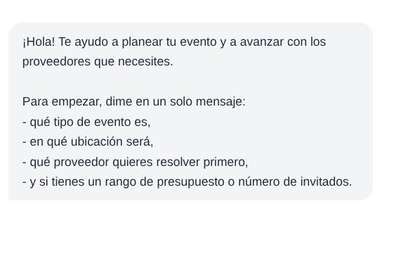 
Usar mayúscula al inicio de cada guion, eliminar la coma al final de los textos y colocar punto final al cierre de cada frase.
---

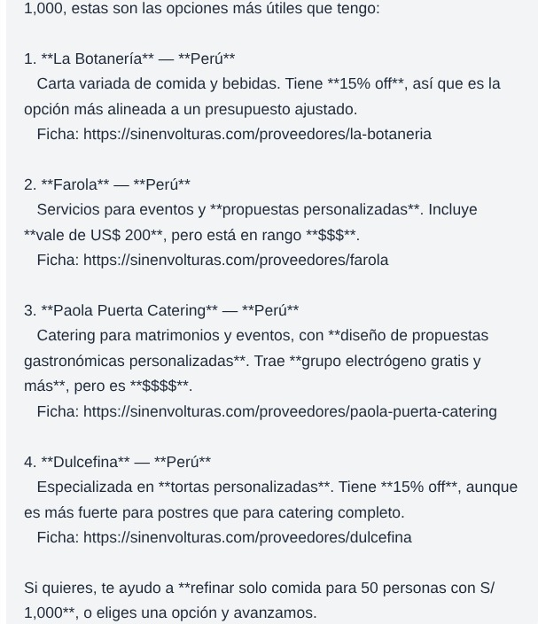 
Pondría en negrita los títulos, eliminaría los asteriscos de arriba, alinearía los textos y no incluiría la opción de Paola Puerta para eventos como cumpleaños, porque en la descripción se indica que es para matrimonios y eventos con un presupuesto que no es el mío (puse un presupuesto bajo de mil soles)
No usaría la palabra “refinar”, ya que no queda claro a que se refiere; quizá quisieron decir “afinar”
---

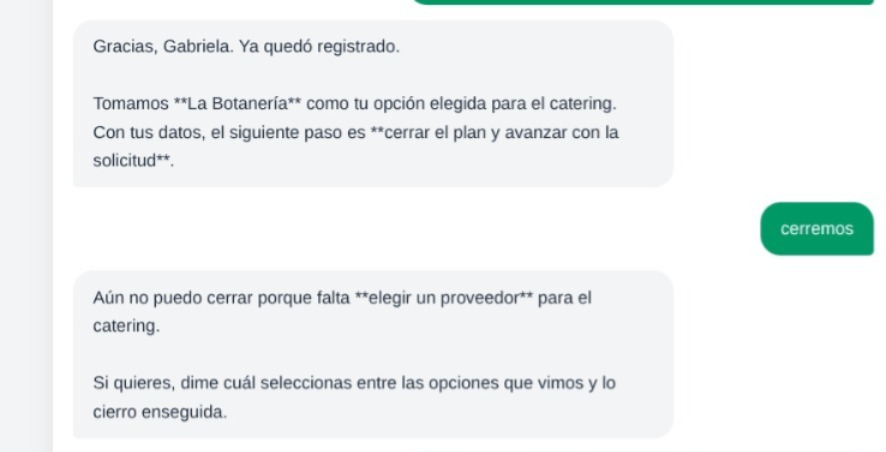 
Me pide elegir un proveedor cuando ya había seleccionado uno
---
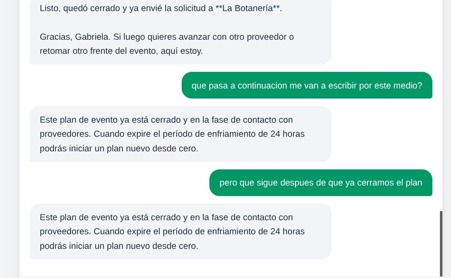 
Deberían incluir un mensaje que indique qué sucede una vez cerrado el contacto con el proveedor: si él me contactará, por qué medio lo hará (chat, correo, mensaje o llamada) y en qué plazo aproximado
---
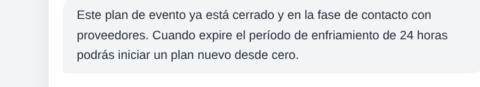 
Mejorar este texto para que se entienda que es un periodo de enfriamiento; sería más claro indicar que puedo retomar el contacto con el agente después de 24 horas
---
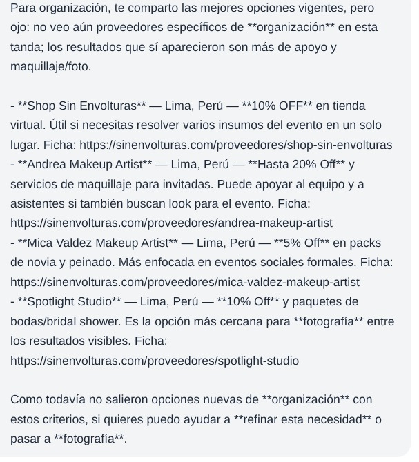 
El texto de la "ficha" debería ir abajo, junto al link.
---
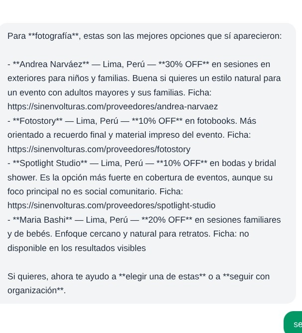 
La proveedora María Bashi no tiene un link en la ficha; se debería incluir
---
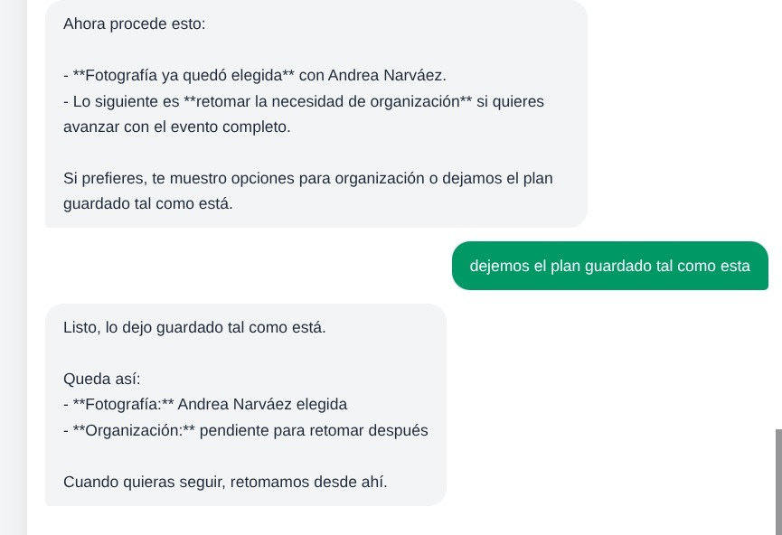 
No aparece un mensaje de cierre  (cuando te piden tu contacto) cuando ya cerré el plan con un proveedor de fotografía
---
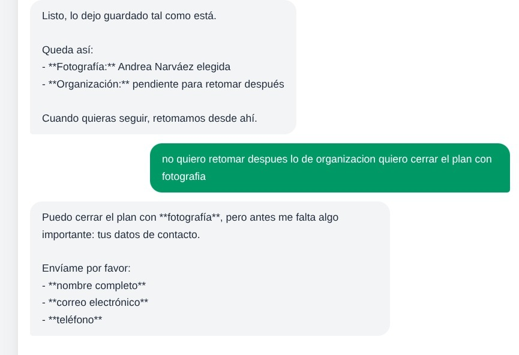 
Se cerró cuando indiqué que no quería retomar lo pendiente; debería agregarse un mensaje que indique que no se puede cerrar si aún hay un pedido o una necesidad por confirmar.
---
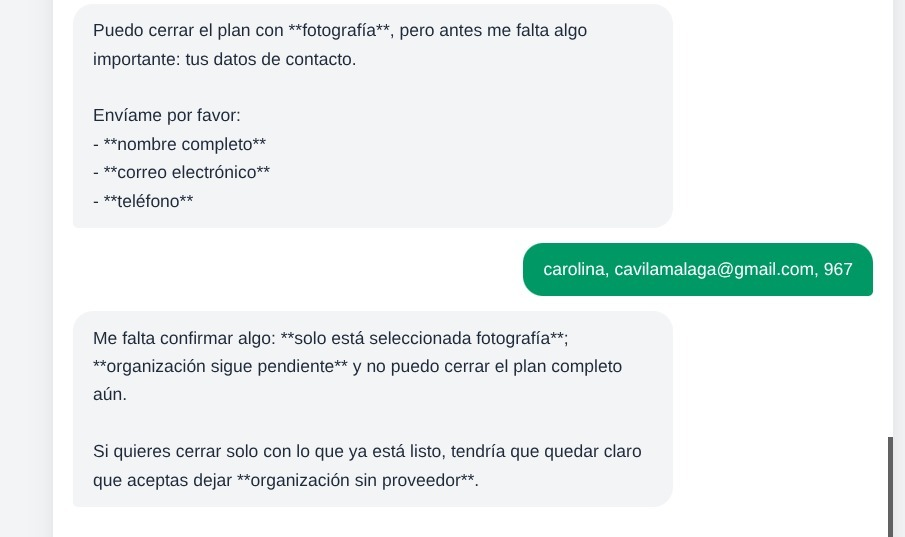 
Al final sí lo mencionan, pero por un tema de orden debería aparecer antes
---
 
Lo mismo con el número de teléfono: se acepta el pedido con un “número de teléfono” de tres dígitos; no debería permitirse eso.
---
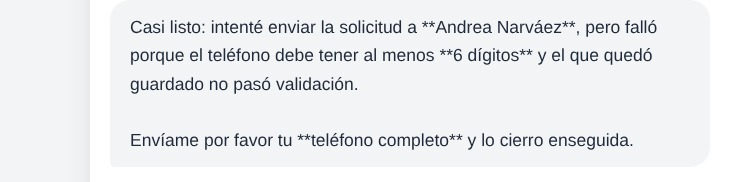 
Al final, antes de cerrar, aparece el mensaje indicándolo, pero por un tema de orden lo pondría ni bien se detecta el número mal digitado.
---
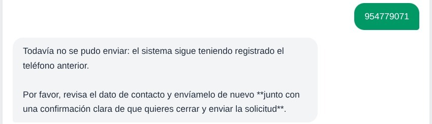 
Piden confirmar el número otra vez aunque ya lo envié, y eso agrega un paso innecesario para el usuario (creo yo)
---
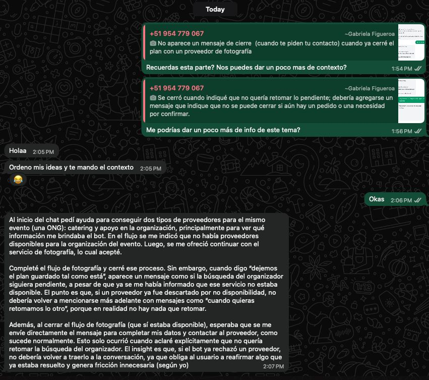 
Las respuestas a las inquietudes
